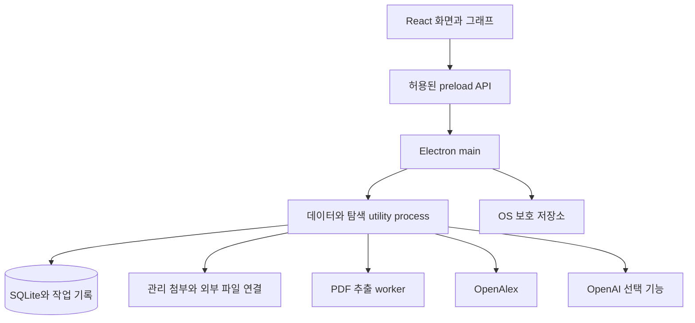

# ResearchBunny implementation plan

_v0.1 · 2026-09-26 · macOS arm64 로컬 시험판 구현 및 검증 기록_

---

> 2026-09-27 변경: Electrobun/WebKit으로 전환하고 파일 드롭을 제외한다. 현재 실행·빌드 구조와 검증은 [마이그레이션 기록](docs/electrobun-migration.md)을 따른다. 아래 Electron 관련 세부 기록은 최초 구현 이력이다.

## 🎯 1. 범위와 기본 기술 선택

### 1.1 구현 목표와 경계

요구사항의 기준은 [PRD.md](./PRD.md)다. 첫 완성판은 PRD의 P0-01–P0-13을 포함한다. 검색어 또는 GPT 핵심 논문 추천에서 출발해, seed 선택·인용 확장·관련성 필터·그래프 inspection·PDF/BibTeX import·아카이브·BibTeX export까지 완결한다.

문서 최초 작성 시점에는 소스코드·패키지·앱 빌드가 없었다. 이후 이 계획에 따라 0.1.0 소스와 macOS arm64 앱을 구현했다. 아래 기술·도메인 경계를 유지하되 작은 구현에서는 작업 체크포인트와 AI 기록을 `runs` JSON에, 노트·태그를 `project_works.state`에 통합했다. 검증 증거와 미완료 출시 항목은 [검증 보고서](docs/verification-report.md)에 기록한다.

첫 출시에서 별도 서버·로그인·클라우드 동기화·참고관리 도구 전용 연동은 만들지 않는다. 새 검색과 AI 호출만 외부 서비스에 의존한다. 앱이 완전히 종료된 동안 작업을 계속하는 상주 서비스도 P0에서 만들지 않는다.

### 1.2 권장 기술 구성

| 영역 | 기본안 | 선택 이유·검증할 점 |
| --- | --- | --- |
| 데스크톱 셸 | Electrobun + macOS WebKit | 그래프·파일·PDF·백그라운드 프로세스를 TypeScript 중심으로 구성. 설치 용량·메모리는 실제 앱에서 확인 |
| 화면 | React + TypeScript + Vite | 검색·표·그래프·상세 패널을 분리하고 빠르게 UI 반복 개발 |
| 로컬 DB | SQLite + `bun:sqlite` | 단일 사용자 데이터·관계·작업 이력·검색 인덱스를 로컬 저장. native module 패키징을 0단계에 먼저 검증 |
| DB 접근 | 전용 Bun child process, 버전별 SQL migration | 동기 DB 호출을 renderer/main 이벤트 루프 밖으로 분리. 쓰기는 한 서비스가 소유 |
| 작업 큐 | SQLite `jobs` + 체크포인트·재시도 시각 | 외부 큐 서버 없이 재실행·취소·중복 방지. 도메인 작업 기록과 같은 DB에서 관리 |
| 그래프 | Cytoscape.js | 노드·edge 스타일과 선택·이동·뷰포트 제어 활용. 500노드·3,000선 측정으로 채택 확인 |
| PDF 추출 | PDF.js (`pdfjs-dist`)의 텍스트·메타데이터 추출 | 로컬 처리, 첫 페이지 중심 식별. 복잡한 레이아웃·스캔은 보류 또는 후속 OCR |
| P0 PDF 열기 | OS 기본 PDF 앱 | 내부 독서·하이라이트는 P1. P0도 파일 열기·Finder 보기·다중 첨부 선택은 제공 |
| BibTeX | 유지보수되는 parser/serializer를 adapter 뒤에 배치 | 정규식만으로 파싱하지 않음. 엔트리·원본 필드 보존 요구를 fixture로 먼저 검증하고 라이브러리 확정 |
| LLM | OpenAI Responses API + 구조화된 출력 | 질문 계획과 후보 평가에 사용. 모델 ID·입력 예산은 설정값, 내용 검증은 앱 책임 |
| 키 보관 | macOS Keychain (이전 safeStorage 파일 보존·키 재입력) | 암호화 가능 여부 확인. 평문 DB·renderer·백업에는 key를 저장하지 않음 |
| 검증·배포 | 단위/통합 테스트, 패키지 런타임 검사·WebKit 수동 QA, macOS 앱/DMG | 개발 모드와 설치된 산출물의 동작을 별도로 확인 |

Electron의 프로세스·보안 경계, SQLite worker/backup 방식, PDF.js 추출은 공식 문서와 Context7을 확인했다. 그래프 조작은 Cytoscape.js 공식 API를 참고한다. 버전은 구현 0단계에 호환되는 안정판으로 고정하고 lockfile에 기록한다. [Electron 보안](https://www.electronjs.org/docs/latest/tutorial/security), [utility process](https://www.electronjs.org/docs/latest/api/utility-process), [SQLite](https://github.com/WiseLibs/better-sqlite3), [PDF.js](https://mozilla.github.io/pdf.js/), [Cytoscape.js](https://js.cytoscape.org/).[^electron-security][^electron-process][^sqlite][^pdfjs][^cytoscape]

### 1.3 먼저 결정하고 고정할 사항

- macOS Apple Silicon을 초기 검증 대상으로 한다. 최소 지원 macOS와 Intel 빌드는 실제 패키징 결과를 보고 명시한다.
- 기본 데이터 위치는 앱 `userData` 아래다. DB는 내부 디스크에 두고 PDF는 관리 복사/기존 위치 연결 중 선택한다.
- 패키징 도구는 Electron Forge를 기본 후보로 두고 Vite·native module·utility process 산출물까지 포함한 작은 설치 앱으로 먼저 검증한다.
- LLM 사용 여부와 두 외부 서비스의 key는 앱 설정에서 관리한다. AI가 없어도 일반 검색부터 export까지 동작해야 한다.
- embedding DB·Python 런타임·별도 HTTP 서버·네트워크 DB는 P0의 필수 의존성으로 추가하지 않는다.

## 🏗️ 2. 구조와 데이터 보존

### 2.1 프로세스 구조



main은 파일 선택·메뉴·창·기본 앱 열기·IPC 발신자 검증을 담당한다. 데이터 서비스는 DB 쓰기와 도메인 규칙을 소유하고, PDF 추출은 별도 작업으로 분리한다. 긴 네트워크 요청 동안 DB 트랜잭션을 열어두지 않는다. 작업 큐가 여러 번 전달할 수 있다고 가정하고 도메인 저장을 멱등적으로 만든다.

P0에서 외부 논문 페이지는 기본 브라우저로 연다. 앱 화면은 패키지 내부 리소스를 사용하며 원격 페이지에 preload의 파일·DB 권한을 연결하지 않는다.

### 2.2 예정 디렉터리 구조

```text
ResearchBunny/
  PRD.md
  IMPLEMENTATION_PLAN.md
  src/
    main/                  창, 메뉴, 파일 접근, 키 보관, IPC 등록
    preload/               제한된 typed bridge
    renderer/
      features/            search, seeds, graph, library, inspector, import, settings
      components/          공통 UI
    service/
      db/                  스키마, migrations, repositories
      jobs/                영속 큐, 체크포인트, 취소, 예산
      providers/           openalex, openai adapters
      discovery/           후보 생성, 집계, 필터, 추천 근거
      library/             식별, 중복, 프로젝트 상태
      interchange/         bibtex, backup, restore
    workers/               PDF·CPU 작업
    shared/                DTO, 스키마, 오류 코드, 순수 도메인 함수
  tests/
    fixtures/              API, 작은 인용 그래프, BibTeX, 합성 PDF
    integration/           DB·작업·파일 시스템 검증
    desktop/               실제 앱 시나리오
    evaluations/           핵심 논문 추천 기준선 비교
  scripts/                 패키징·평가·산출물 확인
```

폴더는 해당 기능을 구현할 때 만든다. 초기부터 사용하지 않는 추상화와 빈 서비스 계층을 모두 생성하지 않는다.

### 2.3 DB의 핵심 제약

| 테이블 묶음 | 주요 제약 |
| --- | --- |
| `works`, `work_identifiers`, `metadata_snapshots` | 앱 내부 UUID가 기준. 공급자+외부 ID unique, DOI 정규화, 원본 메타데이터와 사용자 수정 분리 |
| `projects`, `collections`, `project_works`, `collection_works` | 프로젝트/컬렉션별 중복 unique. 문헌 자체와 읽기·핵심·선별 상태 분리 |
| `notes`, `tags`, `attachments` | 첨부 checksum·managed/linked 구분, 원본 파일명·경로 기록, 삭제 복구 |
| `seed_profiles`, `seed_members` | S0와 Q의 불변 버전. 실행이 특정 버전을 참조 |
| `citation_edges` | citing→cited 두 work ID unique, 공급자·확인 시점. 유사도 edge와 별도 테이블 |
| `exploration_runs`, `run_candidates`, `relation_evidence` | 실행별 St·B·조건·예산·결과 순위·제외 사유·조회 범위 보존 |
| `jobs`, `job_checkpoints`, `provider_usage` | idempotency key, 단계·cursor·heartbeat·retry 시각·누적 사용량 |
| `import_items`, `export_records`, `merge_history` | 파일/엔트리별 성공·보류·오류, citekey 매핑과 병합 전 상태 |
| `ai_runs`, `ai_evidence` | 모델/프롬프트 버전·후보 allowlist·검증 결과·응답 범위·사용량 |

foreign key를 활성화하고 WAL·동기화 정책을 데이터 보존 요구에 맞춰 설정한다. 메타데이터 갱신은 노트·citekey·초기 seed를 변경하지 않는다. 삭제·병합으로 참조 이력이 끊기지 않도록 복구 이력과 외부 ID alias를 남긴다.

SQLite 온라인 backup API 또는 정상 종료 후 일관된 복사를 사용한다. 사용 중인 `.sqlite` 파일만 복사해 WAL의 내용을 빠뜨리는 백업을 만들지 않는다. [better-sqlite3 backup 문서](https://github.com/WiseLibs/better-sqlite3/blob/master/docs/api.md#backupdestination-options---promise).[^sqlite-backup]

### 2.4 파일 보관과 복원

- 관리 첨부는 파일 내용의 해시로 식별하되 문헌·버전·보충자료의 연결은 별도로 보관한다. 같은 파일을 여러 문헌에 연결해도 물리 복사를 반복하지 않는다.
- 외부 파일은 연결만 보관하고 사용자가 원본을 이동하거나 디스크를 분리하면 접근 불가 상태로 남긴다. P0 수동 재연결, P1 일괄 탐색.
- 복사는 대상 볼륨의 임시 경로에 먼저 쓰고 검증 후 확정한다. DB 등록 실패·중간 종료에 대비해 staging 기록으로 미완료 파일을 복구/정리한다.
- backup은 DB 스냅샷·manifest·선택 첨부를 포함한다. 외부 파일도 포함할지 사용자가 고를 수 있고 빠진 파일은 목록으로 기록한다.
- restore는 빈 임시 공간에서 스키마·경로·해시를 검증한 뒤 새 프로젝트/라이브러리로 연다. 앱 외부 경로를 덮어쓰는 압축 해제 경로를 허용하지 않는다.

## 🔌 3. 내부 계약과 외부 조회

### 3.1 IPC 계약

renderer에는 아래와 같은 작업별 API만 제공한다. raw SQL, 임의 파일 읽기, 임의 URL fetch, 임의 IPC 호출을 노출하지 않는다. 응답은 성공 데이터 또는 안정적인 오류 코드·사용자 메시지·재시도 가능 여부로 통일한다.

| 명령 그룹 | 계획할 기능 |
| --- | --- |
| `projects` / `library` | 생성·조회·저장·상태 변경·컬렉션·노트·중복 병합·복구 |
| `search` | 질문/키워드/식별자 요청, 페이지 추가, 캐시 사용 여부 |
| `seeds` | S0 버전 생성, St 선택, 기준 변경 전후 조회 |
| `exploration` | 실행 생성·취소·재개, 후보 목록, 공통 관계, 그래프 데이터 |
| `files` / `imports` | native 파일 선택, 승인된 파일 import, 첨부 열기·Finder 보기, 재연결 |
| `exports` / `backups` | 명시 범위의 BibTeX 생성·저장, 백업·복원 |
| `settings` | key 저장·연결 확인·삭제. key 원문 읽기는 제공하지 않음 |
| `events` | 작업 진행·후보 추가·저장 실패 알림. 구독 해제 지원 |

페이지·선택 범위는 안정적인 work ID 집합으로 전달한다. “필터 결과 전체” export는 실행 시점의 결과 ID를 스냅샷으로 고정해 UI가 바뀌어도 범위가 변하지 않게 한다.

### 3.2 OpenAlex adapter

1. 키워드 검색, 식별자 lookup, 여러 work ID 조회, `cites` 조회, 선택적 의미 검색을 각각 메서드로 분리한다.
2. provider JSON은 경계에서 검증한다. 결측/null을 0으로 바꾸지 않고 제목·초록·관계 데이터의 조회 상태를 보존한다.
3. `abstract_inverted_index`를 위치 기준으로 복원한다. 잘못된 인덱스·빈 필드·이상 텍스트는 오류 또는 보류 상태로 표시한다.
4. 일반 페이지는 최대 100과 cursor를 사용한다. ID lookup은 OR 100개 이하로 나누고 응답 순서가 요청 순서와 같다고 가정하지 않는다.
5. key·검색식·필터·필드·corpus·cursor가 올바르게 전달되도록 URL builder를 사용한다. 키는 가능한 header로 보내고 로그에서 제거한다.
6. 429는 일시 빈도 제한과 일일 예산 소진을 구분해 retry 시점을 정한다. 4xx 문법 오류를 자동 반복하지 않는다.

캐시 key에는 공급자·쿼리·필터·선택 필드·페이지와 스키마 버전을 포함한다. 탐색 결과는 짧은 TTL, 개별 서지정보는 더 긴 TTL을 초기안으로 두되 모든 화면에 확인 시점을 남긴다. 사용자 수동 갱신은 가능하지만 동일 순간의 중복 요청은 합친다.

의미 검색은 최대 2,000자·50결과·1요청/초 제약과 `cited_by_count` 필터 미지원에 맞춘다. 결과 후처리로 최소 피인용수를 적용하더라도 전체 데이터베이스에 그 조건을 걸어 검색한 것과 같다고 표현하지 않는다. [OpenAlex 의미 검색](https://help.openalex.org/api/semantic-search/).[^oa-semantic]

### 3.3 작업 상태와 재개

상태는 `queued → running → completed`를 기본으로 하고 `cancel_requested`, `cancelled`, `paused_budget`, `failed`, `interrupted`를 별도로 둔다. 상태 이름과 사용자 문구는 분리한다.

- 페이지 저장과 다음 cursor 체크포인트를 한 DB 트랜잭션으로 확정한다.
- 외부 요청은 트랜잭션 밖에서 수행하고, 결과 저장 시 `run_id + work_id` 등 unique 제약으로 중복을 막는다.
- 취소 요청 이후 새 외부 호출을 시작하지 않는다. 진행 중 요청은 abort를 시도하되 이미 발생한 외부 비용이 취소된다고 약속하지 않는다.
- 앱 종료 시 정상 체크포인트를 저장한다. 비정상 종료는 오래된 heartbeat로 감지하고 명시적으로 재개 가능한 상태로 바꾼다.
- 프로세스 재시작은 곧바로 무한 재호출하지 않는다. 이미 성공한 단계·실패 원인·남은 예산을 확인한다.
- 일반 탐색/AI 추천의 후보·요청 예산은 PRD 4.4–4.5를 공유한다. worker가 여러 개여도 공급자별 호출 한도는 한곳에서 집계한다.

### 3.4 추천·설명 계약

후보마다 `work_id`, 발견 출처, 연결 seed ID, 관련성 근거, 실제 공유 문헌 ID, 필터 통과/제외/보류 이유, 데이터 범위, 추천 모델 버전을 기록한다.

OpenAI에는 Q와 검증된 후보 메타데이터를 보낸다. 구조화 출력 스키마는 후보 ID·역할·관련성 판단·근거 ID·제한점을 받으며 거부·incomplete·파싱 실패를 별도 처리한다. 스키마를 지켰다는 사실은 내용이 사실이라는 보장이 아니므로 ID allowlist, 수치·근거 존재, 입력 범위 검증과 사람 평가를 추가한다. [OpenAI Structured Outputs](https://developers.openai.com/api/docs/guides/structured-outputs).[^openai-structured]

LLM은 DB 쓰기·파일 접근·임의 검색 도구 권한을 갖지 않는다. 검색 계획은 앱의 제한된 query schema로 검사한 뒤 adapter가 실행한다. 참고문헌이나 PDF에 포함된 지시문은 데이터로만 전달한다.

## 🧱 4. 구현 단계 A — 기반에서 실제 검색까지

체크된 항목은 해당 구현과 명시된 범위의 검증을 마쳤다. 미체크 항목도 일부 구현되어 있지만 항목 전체의 검증을 마치지 않았다. 체크리스트는 공개 배포 승인이나 GPT 추천 품질 통과를 뜻하지 않는다. 실제 증거는 [검증 보고서](docs/verification-report.md), 사람 평가 상태는 [추천 평가 보고서](docs/evaluation-report.md)를 따른다.

### 단계 0. 실행·패키징 가능성 확인

**목표:** 선택한 기술로 사용자의 Mac에서 실행되는 설치 앱을 먼저 확보한다.

- [x] Electron·React·TypeScript·Vite 기본 프로젝트, package manager·lockfile·lint·typecheck 구성
- [ ] renderer 보안 설정과 최소 typed IPC, native 파일 선택, OS 보호 key 저장 가능 여부 확인
- [x] utility process에서 SQLite 생성·저장·재열기, 종료·재시작 확인
- [x] native SQLite 모듈·PDF.js worker·앱 아이콘/리소스를 포함한 최소 `.app` 패키징
- [x] BibTeX parser 후보로 기관 저자·중괄호·매크로·원본 필드 보존 가능성 확인
- [x] library path·첨부 복사/연결 기본값·지원 macOS·배포 도구 결정 기록

**완료 조건:** 개발 모드와 Finder에서 연 패키지 앱 모두 파일 선택·DB 저장·재실행이 동작한다. Terminal PATH에 없는 실행파일을 요구하지 않는다. 이 단계는 배포 품질 완성을 뜻하지 않는다.

### 단계 1. 로컬 라이브러리와 BibTeX 왕복

**연결 요구:** P0-07/09/11/12, AC-01/06/07/12의 기본 경로.

- [x] Work·식별자·프로젝트·컬렉션·읽기 상태·노트·citekey 스키마와 migration
- [x] 수동 문헌 등록, 포함/제거, 태그·핵심 표시, 자동 저장, 휴지통
- [x] 휴지통 선택 영구 삭제·전체 비우기, 확인창, 트랜잭션·프로젝트 격리·실행 취소 정리·PDF 보존 검사
- [x] BibTeX import 미리보기·항목별 실패·중복 연결·사용자 수정 보존
- [x] 전체/프로젝트/컬렉션/선택 export와 citekey 충돌 매핑
- [x] DB backup·별도 라이브러리 restore의 최소 흐름

**완료 조건:** 네트워크 없이 100개 이상의 BibTeX fixture를 가져와 편집·export·재import해 중복과 주요 필드 손실이 없다. 강제 종료 후 저장된 노트가 유지된다.

### 단계 2. OpenAlex 검색과 seed 설정

**연결 요구:** P0-01/02/11/12, AC-01/05/11.

- [x] key 설정·연결 상태·검색 adapter·오류·캐시·호출량 기반 구축
- [x] 키워드/제목/DOI/OpenAlex ID 검색과 페이지 추가
- [x] 목록·기본 상세 패널·저장·다중 선택, 초록 복원과 결측 UI
- [x] Q·S0 버전 저장, 현재 St와 초기 seed 시각 구분, 사용자 seed 그룹
- [x] 검색으로 얻은 문헌과 BibTeX 문헌의 식별자 병합

**완료 조건:** 검색 → 3편 seed 지정 → 1편 저장 → 앱 재시작 경로를 실제 데이터로 확인한다. 이미지 예시 논문의 초록 결측도 실패 없이 처리한다.

### 단계 3. 인용 확장·공통 기반·주제 필터

**연결 요구:** P0-03/04/05/06/12, AC-02/03/04/05/08/11.

- [x] `related_works`, References, Cited by 후보 수집과 제한된 이웃 확장
- [x] 공통 참고문헌, 여러 B 문헌을 인용한 후속 논문 집계와 근거 목록
- [x] 확보한 이웃의 서지결합·공동인용 신호, 조회 범위·부분 결과 표시
- [x] Q/S0 텍스트·주제 관련성 기준선, 미상/보류, 연도·피인용수·유형·제외어 필터
- [x] 단계별 St·조건·cursor·예산·추천 이유 기록, 취소·중단·재개
- [x] 저장·제외된 후보 구분, 자동 재귀 없이 다음 단계 실행

**완료 조건:** 작은 정답 그래프에서 관계 집계가 정확하다. 같은 후보를 여러 경로로 발견해도 근거만 추가되고 문헌은 늘어나지 않는다. 넓은 방법론 논문을 거쳐도 S0가 유지되고 주제 이탈이 필터로 드러난다.

## 🖥️ 5. 구현 단계 B — 시각화·기존 파일·GPT 추천

### 단계 4. 그래프·연도 배치·inspection

**연결 요구:** P0-08, AC-02/06/11. 단계 3의 동일 후보·관계 데이터를 사용한다.

- [x] 목록과 그래프가 공유하는 work ID 기반 선택·필터 상태
- [x] Cytoscape.js 연결 그래프, 직접 계산한 연도 좌표 배치, 미상 연도 영역
- [x] 실제 인용 화살표와 유사도 관계 구분, seed·후보·저장·선택 범례
- [x] 클릭·다중/박스 선택·키보드 선택·주변 보기·위치 복원
- [x] 우측 상세 패널과 추천 이유, 단일·일괄 저장·seed 지정·export
- [ ] 그래프 표시 상한, 라벨 밀도·비선택 edge 생략, 신규 후보 추가 시 기존 위치 유지

**완료 조건:** 500노드·3,000선을 기준 환경에서 측정한다. 필터로 일부 선택이 숨겨져도 선택 수·export 범위가 일치한다. 그래프 기능 없이도 목록에서 동일 작업을 수행할 수 있다.

### 단계 5. 로컬 PDF import와 첨부 관리

**연결 요구:** P0-10/11/12, AC-01/07/08/12. 단계 1의 저장·중복 기준을 재사용한다.

- [x] 여러 파일·폴더 대화상자 선택 (드롭 제외), 하위 폴더/컬렉션 매핑, 관리 복사/외부 연결
- [x] 파일 해시·metadata·첫 페이지 제목·저자·DOI 추출을 별도 worker에서 수행
- [ ] 식별자 exact match와 제목·저자·연도 후보 비교, 명백한 충돌의 수동 확인
- [x] 기존 문헌에 첨부 연결, 미확인·암호화·스캔·손상 파일의 대기함
- [x] OS PDF 앱 열기, Finder 보기, 파일 재연결, 원문·보충자료·버전별 첨부
- [ ] 파일 복사 취소·디스크 부족·외장 볼륨 분리 복구, 첨부 포함 backup/restore

**완료 조건:** 동일 PDF 반복 import, 참고문헌 DOI 오인, 같은 제목의 다른 버전, 잘못된 metadata, 파일 이동, 중간 취소를 확인한다. 입력 원본의 해시·이름·위치는 변하지 않는다. 텍스트 추출 실패도 파일 연결과 수동 등록은 가능하다.

### 단계 6. GPT 핵심 논문 찾기

**연결 요구:** P0-13과 P0-01/03/05/06, AC-04/05/10/11. 단계 2–3의 검색·검증·예산을 재사용한다.

- [x] 첫 화면의 “핵심 논문 찾기”, 연구 질문과 추천 범위 표시
- [x] query planner: 핵심 개념·하위 주제·검색식·제외 범위를 구조화
- [ ] 일반 검색·의미 검색·인용 이웃의 제한된 후보 수집과 중복 제거
- [x] Q 관련성·인용·시기·주제 분포로 평가 후보를 60편 이하로 압축
- [x] GPT 평가: 후보 ID·역할·추천 이유·근거 ID·정보 부족 출력
- [x] allowlist·식별자 일치·수치·근거 참조 검증, 거부·incomplete·형식 오류 처리
- [ ] 역할별 10–20편 추천, 제외·재정렬·초기 seed 채택·컬렉션 저장
- [x] 모델/프롬프트 버전·입력 범위·사용량·실행 결과 보존, AI 미설정/장애 fallback

**완료 조건:** 후보에 없는 문헌과 잘못된 근거 ID가 사용자 추천에 들어가지 않는다. 초록이 없으면 제목 기반 판단의 한계가 드러난다. 사람이 검토한 평가 질문으로 기준선보다 가치가 있는지 측정한다. 모델 호출 성공 자체를 추천 품질 통과로 간주하지 않는다.

### 단계 7. 통합 검증·설치 산출물

**연결 요구:** 모든 P0와 NFR, AC-01–AC-12.

- [ ] PRD 9.1의 전체 시나리오를 실제 설치 앱에서 수행
- [ ] 작업 중 강제 종료·잠자기/복귀·인터넷 단절·키 오류·예산 소진·디스크 부족 확인
- [x] 빈 라이브러리에 첨부 포함 복원 후 문헌·노트·관계·파일 해시 비교
- [x] 키보드 조작·창 크기·긴 제목·저자 없음·다중 선택·다크모드 확인
- [x] macOS `.app`와 DMG 생성, native module·worker·PDF 리소스 포함 여부 검사
- [ ] Finder 실행과 제한된 PATH 환경에서 실제 검색·import·export·재시작 검증
- [x] API 키·기기 절대 경로·비공개 노트의 bundle/log/export 노출 검사
- [x] 사용자 도움말, 데이터 위치·백업·API 설정·버전/제한 안내, 검증 보고서 작성

**완료 조건:** 실제 산출물 경로와 플랫폼·아키텍처·버전·검증 결과를 남긴다. Developer ID 인증서와 notarization 자격이 있으면 해당 배포 경로를 검증한다. 없으면 로컬 시험용 산출물의 ad-hoc 서명/무서명 상태를 분명히 기록하고 정식 서명·공증이 완료됐다고 표시하지 않는다.

## 🧠 6. 추천 알고리즘의 구현·평가 순서

### 6.1 P0 기준선

초기 버전은 설명 가능한 로컬 계산을 먼저 만든다.

1. 제목·복원 초록·Q에서 Unicode 정규화한 토큰/구를 만들고 사용자 포함·제외어를 보존한다. 영문과 한국어를 지원하되 자동 번역은 별도 제안 단계로 둔다.
2. P0 기준선에서는 고정 후보 스냅샷의 TF-IDF cosine, 구 일치, OpenAlex topic 겹침을 텍스트·주제 신호로 사용한다. 하나의 신호를 내용 전체의 이해라고 설명하지 않는다.
3. 각 seed와의 신호를 따로 계산해 가까운 seed와 그룹별 점수를 남긴다. 평균 하나 때문에 작은 관심 갈래가 사라지지 않게 한다.
4. 직접 인용·공통 기반·연결 seed 수·서지결합/공동인용을 관계 신호로 계산한다. 확보하지 못한 이웃은 미상이다.
5. 명시 조건과 관련성 문턱을 먼저 적용한 뒤, 통과 후보를 내용·관계 중심으로 정렬한다. 영향력은 보조 신호이고 전역 피인용수는 로그 변환 또는 후보 내 순위로 크기를 제한한다.
6. 최종 화면에서는 하위 주제·시기·역할 분포를 점검하고 같은 유형이 상위 전체를 차지하는 경우 분리 목록을 제공한다.

초기 가중치·엄격도 경계는 설정 파일과 `ranking_version`으로 보존한다. 후보 집합이 달라지면 TF-IDF와 점수가 달라질 수 있으므로 다른 실행의 숫자를 절대 척도로 비교하지 않는다. 수치 조정에는 별도 튜닝 질문을 쓰고 최종 평가 질문을 반복해서 맞추지 않는다.

### 6.2 GPT와 검색의 역할 분리

| 단계 | GPT의 역할 | 앱이 직접 보장할 것 |
| --- | --- | --- |
| 시작 | 분야 설명을 검색어·하위 질문으로 정리 | 원 질문 유지, query schema·최대 검색식 검사 |
| 후보 수집 | 선택적으로 검색 방향 제안 | 실제 API 호출·식별자 확인·예산·중복 처리 |
| 중요도 평가 | 제공된 내용에서 연구 질문과의 관련성·역할 설명 | 검증된 후보만 입력, 출처 범위와 결측 표시 |
| 결과 작성 | 짧은 근거 설명과 역할별 추천 | 후보 ID·근거 ID·수치 일치, 사용자 채택 전 자동 저장 금지 |

“논문이 실재한다”와 “그 논문이 이 분야의 핵심이다”는 검증 방식이 다르다. 전자는 식별자·서지정보로 확인하고, 후자는 연구 질문에 맞춘 사람 평가로 확인한다. 근거 ID가 존재한다고 의미적 설명까지 자동 증명되는 것은 아니다. 설명의 지지 여부도 표본 검토한다.

사용자가 고인용 중심 목록을 원하는 경우 정렬 옵션으로 제공한다. 기본 핵심 추천에서는 새롭지만 인용이 적은 논문과 관심 질문에 직접 맞는 논문이 구조적으로 제외되지 않게 한다.

### 6.3 평가 데이터와 출시 결정

- 소규모 정확성 fixture: 8–12개 논문으로 인용 방향·공통 reference·공동인용·서지결합을 수작업으로 계산한 그래프
- 결측/편향 fixture: 초록 없는 고전, 무인용 최신 논문, 다른 분야 고인용 방법론, preprint/출판본, 연도 역전
- 추천 평가 세트: 최소 5개 연구 질문, 질문당 50편 이상 검토 후보, 알려진 핵심 문헌 약 10편
- 비교 조건: 검색 점수순, 피인용수순, 로컬 내용+관계, GPT 추가의 후보/호출 예산을 맞춤
- 측정: 후보 회수, Precision@10, nDCG@10, 주제·역할 분포, 설명 근거 오류, 실행 시간·비용

실험 결과는 `tests/evaluations/`의 입력 스냅샷과 앞으로 만들 `docs/evaluation-report.md`에 기록한다. 실재하지 않는 문헌 0건과 PRD의 잠정 적합성 목표를 확인한다. GPT가 도움이 되지 않으면 추천 기능을 실험 표시로 유지하고 비용만 늘리는 기본 동작으로 만들지 않는다.

## 🧪 7. 검증 전략과 운영

### 7.1 무엇을 어디에서 검증할지

| 수준 | 범위 | 실행 원칙 |
| --- | --- | --- |
| 순수 함수 | ID·DOI 정규화, 초록 복원, 집계·필터·순위 구성, citekey·export 범위 | 결정적 fixture, 네트워크 없음 |
| DB·파일 통합 | migration·중복 제약·트랜잭션·재개·병합 취소·원본 보존·backup | 임시 데이터 공간과 합성/허가된 fixture 사용 |
| provider 계약 | 실제 응답과 형식 변경, null·429·cursor·선택 필드 | 주 테스트는 저장 fixture, 제한된 live smoke는 별도 실행 |
| 실제 앱 | 파일 선택·그래프 selection·외부 PDF 열기·오프라인·설치 실행 | 개발 모드와 패키지 앱 둘 다 확인 |
| 추천 평가 | 후보 회수·내용 적합성·다양성·근거 | 사람이 검토한 질문과 동일 예산 기준선 비교 |

정상 저장 이후의 강제 종료와 아직 진행 중인 쓰기 중단을 구별해 시험한다. UI 스냅샷만으로 파일 보존·선택 export·인용 방향을 검증했다고 간주하지 않는다. 실제 외부 API를 모든 테스트마다 호출하지 않는다.

### 7.2 진단·비용·비밀값

- 로그는 run ID·단계·기간·수집수·오류 코드·공급자 사용량 중심이다. 원 질문·초록·노트·키는 기본 로그에서 제외한다.
- OpenAlex/GPT 연결 확인과 모델별 사용량은 설정에 보여준다. 기본 사용 상한은 앱에서 적용하고 모델·요금 변경 시 다시 검증한다.
- transient failure와 영구 실패를 분리한다. 실패 job은 조회·재시도·삭제가 가능하고 삭제가 저장 문헌을 제거하지 않는다.
- 전체 후보와 상세 근거는 실행 이력에 보관하되 오래된 API 캐시 정리와 영속 아카이브 삭제를 구별한다.
- macOS secure storage를 이용할 수 없으면 키 입력·오류 경로를 제공하고 자동으로 평문 저장으로 전환하지 않는다. [Electron safeStorage](https://www.electronjs.org/docs/latest/api/safe-storage).[^electron-storage]

### 7.3 배포·업데이트·복구

첫 시험 배포는 수동 설치로 진행한다. 자동 업데이트는 서명된 배포와 데이터 migration 복구가 확인된 뒤 도입한다. 개발 환경 캐시와 사용자 데이터 경로를 구별하고 새 버전을 설치해도 `userData`를 초기화하지 않는다.

스키마 변경 전 backup을 생성하고 migration 버전을 기록한다. 이전 앱이 더 새로운 DB를 읽으면 조용히 수정하지 않고 지원 불가를 알린다. 롤백은 새 스키마 파일을 이전 버전에 억지로 연결하는 대신 호환되는 backup으로 복구한다.

앱 번들에는 필요한 worker 코드·native module·PDF 리소스를 포함한다. 설치 앱의 작업 디렉터리나 사용자의 Terminal PATH에서 개발 리소스를 찾도록 구현하지 않는다. 서명·공증·산출물 해시·실행 결과는 배포 기록으로 남긴다.

## 📋 8. 의존성·위험·다음 실행 단위

### 8.1 단계 의존성과 완료 순서

| 단계 | 선행 조건 | 사용자에게 보이는 결과 |
| --- | --- | --- |
| 0 | 없음 | 설치 가능한 최소 앱과 기술 조합 검증 |
| 1 | 0 | 오프라인 라이브러리와 BibTeX 왕복 |
| 2 | 1 | 실제 논문 검색·상세·초기 seed |
| 3 | 2 | 관련 논문·인용 확장·공통 기반·주제 유지 |
| 4 | 3 | 목록과 동기화되는 그래프·연도 보기 |
| 5 | 1–2 | 기존 PDF와 아카이브 연결·원본 보존 |
| 6 | 2–3 | 근거를 가진 GPT 핵심 논문 추천 |
| 7 | 4–6 및 모든 P0 | 실제 사용 가능한 macOS 앱·DMG와 검증 보고 |

기능 가치 순위와 개발 순서는 다르다. GPT 추천이 제품의 중요한 진입점이어도 실제 후보 검색·식별·근거 저장을 먼저 구현한다. 단계 4–6은 계약이 안정되면 순서를 조정할 수 있으나 첫 완성판에서 빠져서는 안 된다. 날짜 추정은 0–2단계의 실제 작업량을 확인한 뒤 기록한다.

### 8.2 주요 위험과 대응

| 위험 | 조기 확인·대응 |
| --- | --- |
| native SQLite 모듈이 설치 앱에서 로드되지 않음 | 0단계에 실제 아키텍처·Electron ABI·패키지 포함 경로 검증 |
| OpenAlex 누락 때문에 핵심 문헌을 놓침 | 초록/인용 결측 표시, 제목 검색·수동 등록·보유 PDF 활용, 보조 공급자는 P2 |
| `related_works`와 높은 피인용수의 편향 | Q/S0 필터·다양한 후보 경로·최신/기반 분리·평가 세트 |
| 그래프가 복잡해져 선별하기 어려움 | 표시 상한·선택 주변·안정된 위치·동등한 목록 기능 |
| BibTeX 일부 필드 유실 | 원 엔트리 보존·호환 fixture·재import 비교·손실 보고 |
| PDF 메타데이터 오인 | DOI와 제목·저자 함께 검증, 저신뢰 자동 병합 금지 |
| GPT의 그럴듯한 근거 생성 | 후보 allowlist·입력 근거 범위·구조화 출력·사람 검토·실험 표시 |
| 파일 이동·외장 디스크·저장 공간 부족 | 관리 복사/연결 선택, staging, 복구 가능한 상태·재연결 |
| DB/worker 종료 중 상태 손실 | 단일 쓰기 소유자, 트랜잭션 체크포인트, heartbeat·멱등 저장 |
| 연구 관심·키의 외부 노출 | 로컬 데이터 기본, 외부 호출 범위 분리, OS 보호 키 저장·로그 마스킹 |

### 8.3 구현 시작 시 첫 작업 묶음

실제 구현을 시작할 때의 첫 단위는 **0단계와 1단계의 최소 수직 흐름**이다: 앱 실행 → 프로젝트 생성 → BibTeX 몇 편 import → 논문 상세와 노트 편집 → 선택 export → 앱 재실행 후 상태 확인. 동시에 native module과 utility process가 포함된 작은 설치 앱을 검증한다.

이후 실제 OpenAlex 검색을 연결하고 인용 확장·그래프·PDF·GPT로 확장한다. 각 완료 단계에는 변경 내용, 실행한 검증, 산출물 경로, 알려진 제한을 기록한다. 이 문서를 구현 경계로 사용하며 P1–P3는 별도 우선순위 조정 없이 P0 개발에 끼워 넣지 않는다.

### 8.4 참고 문서

[^electron-security]: [Electron — Security](https://www.electronjs.org/docs/latest/tutorial/security). renderer·preload·IPC와 외부 콘텐츠의 권한 경계.
[^electron-process]: [Electron — utilityProcess](https://www.electronjs.org/docs/latest/api/utility-process). 독립 작업 프로세스.
[^electron-storage]: [Electron — safeStorage](https://www.electronjs.org/docs/latest/api/safe-storage). OS 기반 비밀값 보호.
[^sqlite]: [better-sqlite3](https://github.com/WiseLibs/better-sqlite3). SQLite·트랜잭션·worker 활용.
[^sqlite-backup]: [better-sqlite3 — API](https://github.com/WiseLibs/better-sqlite3/blob/master/docs/api.md#backupdestination-options---promise). 온라인 backup.
[^pdfjs]: [Mozilla PDF.js](https://mozilla.github.io/pdf.js/). PDF 처리 기반.
[^cytoscape]: [Cytoscape.js](https://js.cytoscape.org/). 그래프 표시·선택·뷰포트.
[^openai-structured]: [OpenAI — Structured Outputs](https://developers.openai.com/api/docs/guides/structured-outputs). 구조화 출력과 거부·불완전 응답·내용 오류의 구분.
[^oa-semantic]: [OpenAlex — Semantic search](https://help.openalex.org/api/semantic-search/). 의미 검색 제약.

OpenAlex의 나머지 출처·실제 smoke 확인 범위는 PRD 7장과 10장에 모았다. 기술 선택은 공식 문서에 대한 제품 설계 판단이며 성능·호환성 달성을 미리 주장하지 않는다.

## 2026-09-26 구현 결과와 남은 검증

### 0.1.2 후속 개선: 디자인 시안 적용

- 다섯 화면 시안을 바탕으로 탐색 통합 메뉴, 상세 탭, 아카이브 읽기 필터, 분기 이력과 전체 화면 설정을 구현했다.
- 타입 검사·린트·빌드, 통합 19개 및 개발 앱의 데스크톱·탐색·디자인 검사를 통과했다. 범위와 재현 절차는 [디자인 QA](docs/DESIGN_CONCEPT_QA.md)에 기록했다.

### 0.1.1 후속 개선: 탐색 단계 복귀와 기능 설명

- 뒤로/앞으로 및 부모 단계 경로를 제공하고, 당시 선택·필터·보기·페이지·상세 패널을 복원한다.
- 프로젝트별 이동 기록을 로컬 저장한다. 돌아가 다른 탐색을 실행해도 기존 탐색 결과는 보존한다. 새 키워드 검색은 새 경로로 시작한다.
- 주요 메뉴·탐색·선택·그래프·설정 조작에 hover/focus 설명을 추가한다. 기존 디자인을 유지하며 새 메뉴 묶음은 만들지 않는다.
- 10편 검색 → 3편 선택 → 관련 논문 → 복귀 → 같은 3편의 후속 인용 흐름, 단계 직접 이동·재시작·프로젝트 분리·설명 노출을 검증한다.

- 통합 18개, 패키지 앱의 탐색·설명 6개 및 기존 데스크톱 13개 검사를 통과했다. 0.1.1 DMG를 생성하고 서명 무결성을 확인했다. 자세한 재현 절차와 범위는 [탐색 QA](docs/NAVIGATION_QA.md)에 기록했다.

### 초기 0.1.0 검증 기록

- Electron 44.4.5 / React 19.3 / TypeScript 6 / Vite 8 / SQLite / Cytoscape / PDF.js / Citation.js로 0.1.0 구현. 단일 utility process와 PDF worker, sandbox preload 경계를 실제 패키지에서 확인했다.
- 로컬 자료·검색·초기 seed 고정·단계별 인용 확장·관련성 필터·공통 관계 근거·목록/그래프/연도·BibTeX 왕복·PDF 관리·백업/복원을 사용할 수 있다.
- 15개 통합 테스트, 13개 패키지 데스크톱 검사, 실제 OpenAlex DOI/참고문헌/후속 인용을 통과했다. 실제 조회는 참고문헌 191편과 후속 인용 100편의 부분 범위를 확인했다.
- 5,000문헌/30,000인용선 목록 p95 316ms, 500노드/3,000선 그래프 프레임 p95 23.9ms. 측정 기기는 M2 Max 64GB이며 계획의 16GB 기준 기기 검증은 남는다.
- GPT는 엄격한 후보 검증과 예산 흐름을 구현했지만 실제 OpenAI 호출 및 5×50편 사람 평가는 미완료다. 의미 검색과 AI 역할 분포의 live 품질도 미검증이므로 실험 표시를 유지한다.
- PDF 식별은 DOI exact match와 제목 일치만 자동 채택한다. 저자·연도까지 결합하는 불확실 매칭과 광범위한 스캔/암호화/손상 PDF 표본 검증은 남는다. 불확실 자료는 수동 검토로 보존한다.
- 그래프는 인용/유사 관계를 실선 화살표/점선으로 구별한다. 모든 비선택 edge를 생략하는 별도 성능 모드 대신 상한과 주변 강조를 사용한다.
- 키체인 실제 키 저장·재읽기, 잠자기/복귀, 물리적 디스크 부족/외장 볼륨 분리, 읽기/쓰기 도중 본체 강제 종료, 전체 접근성 수동 점검은 완료로 표시하지 않는다.
- 로컬 ad-hoc 서명이며 Developer ID 공증 및 다른 Mac의 Gatekeeper 통과를 의미하지 않는다. P1–P3는 구현 범위 밖이다.
