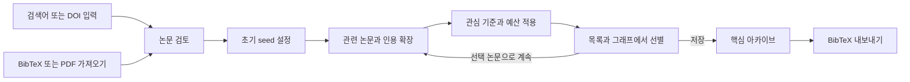

# ResearchBunny PRD

_제품 요구사항 · v0.1 · 2026-09-26 · 개인 연구자를 위한 논문 발견·인용 탐색·아카이브 데스크톱 앱_

---

## 🎯 1. 제품 방향

### 1.1 목표

ResearchBunny는 **관심 논문을 출발점으로, 연구 주제를 유지하면서 과거의 기반 연구와 후속 연구를 발견하고, 검토한 핵심 논문을 재사용 가능한 아카이브로 만드는 앱**이다.

첫 번째 완성 기준은 다음 흐름이 끊김 없이 동작하는 것이다.

> 검색어 또는 기존 논문 입력 → 관심 논문 선택 → 관련 논문 탐색 → 참고문헌·후속 인용으로 확장 → 관련성 판단과 선별 → 아카이브 저장 → BibTeX 내보내기

검색 결과의 양보다 **유용한 논문을 놓치지 않고, 왜 발견됐는지 이해하며, 다시 찾고 활용할 수 있는 경험**을 우선한다. “Key article”은 단일 점수로 확정하지 않는다. 사용자가 지정한 핵심 논문, 아카이브가 자주 참고한 기반 논문, 분야에서 많이 인용된 논문, 최근 후속 논문을 각각 보여준다.

### 1.2 사용자와 사용 상황

| 사용자 상황 | 해결할 문제 | 원하는 결과 |
| --- | --- | --- |
| 새로운 주제에 진입 | 검색어는 알지만 대표 논문을 모름 | 시작하기 좋은 seed와 연구의 큰 흐름 |
| 관심 논문 3–10편을 확보 | 참고문헌과 인용 논문을 수동으로 따라가야 함 | 관련성이 유지되는 반복 탐색 |
| 문헌을 수백 편 수집 | 중복·주제 이탈·읽기 상태가 섞임 | 선별된 핵심 아카이브와 정리 기준 |
| 기존 PDF·BibTeX 보유 | 기존 자료와 새로운 탐색이 분리됨 | 기존 자료에서 바로 탐색 시작 |
| 논문·제안서 작성 | 필요한 문헌과 인용정보를 다시 찾아야 함 | 선택 문헌의 정확한 BibTeX와 저장 근거 |

### 1.3 명시 요청과 제안의 구분

| 구분 | 내용 |
| --- | --- |
| 사용자 필수 요구 | 검색어 검색, 논문 선택 후 OpenAlex 기반 관련 논문 탐색, 공통 참고문헌과 후속 인용을 통한 확장, 주제 이탈·피인용수 필터, 핵심 아카이브, 그래프, 단일·다중 선택과 inspection·저장, 전체·선택 BibTeX export, BibTeX import, 내려받은 논문 import |
| 후속 요청 반영 | GPT를 활용해 분야의 핵심 논문을 먼저 제안하는 진입점 검토. 실제 후보 검색과 검증을 결합한 방식으로 첫 출시 선택 기능에 반영 |
| 본 PRD의 추가 제안 | 초기 seed 고정, 탐색 이유 표시, 검토 대기함, 제외 이유, 중복·버전 관리, 실행 취소, 검색 이력, 데이터 누락 표시, 백업·복원, 후속 알림 |
| 작업 범위 | 제품 요구사항과 별도 구현 계획 작성. 기술 구성은 권장안이며 앱 구현·빌드·배포는 아직 수행하지 않음 |
| 설계 가정 | 데스크톱 앱으로 구현 — 사용자 최종 선택. macOS 우선을 기본안으로 두고 로컬 DB·파일 보관, 한국어 UI와 원문 서지정보 병행 |

ResearchRabbit 공식 가이드는 키워드·DOI·컬렉션·BibTeX로 시작하는 반복 탐색과 논문 상세에서의 참고문헌·피인용 탐색을 설명한다. 이를 제품 흐름의 참고로 삼는다. 공개 설명만으로 내부 알고리즘을 동일하게 재현할 수 있다고 전제하지 않는다. [ResearchRabbit 검색 가이드](https://learn.researchrabbit.ai/en/articles/12454528-how-to-search-in-researchrabbit), [인용 탐색 가이드](https://learn.researchrabbit.ai/en/articles/12454564-how-do-i-see-citations-and-references-in-the-new-researchrabbit).[^rr-search][^rr-citations]

### 1.4 설계 원칙과 첫 출시 제외 범위

1. **초기 관심 유지:** 새로운 후보를 발견하거나 저장했다고 최초 관심 주제가 자동으로 바뀌지 않는다.
2. **발견과 채택 분리:** 후보 조회, 화면 선택, seed 지정, 아카이브 저장은 서로 다른 행동이다.
3. **관계와 근거 설명:** 실제 인용 관계와 알고리즘이 추정한 유사성을 구분한다.
4. **자료를 잃지 않음:** 네트워크나 OpenAlex·AI API가 실패해도 로컬 저장 문헌, 연결된 PDF, 노트와 내보내기는 이용할 수 있다.
5. **불완전성을 보임:** “연결 없음”, “아직 조회 안 됨”, “제공 데이터 없음”을 구별한다.
6. **사용자 판단 우선:** 높은 피인용수나 높은 유사도만으로 논문의 타당성·중요성을 확정하지 않는다.

첫 출시에서는 실시간 공동 편집, 클라우드 동기화, 소셜 피드, 모바일 전용 앱, 자동 문헌고찰 작성, 논문 전문 Q&A, 모든 PDF 자동 수집을 제외한다. 이 기능들이 없어도 위의 핵심 흐름은 완결되어야 한다. ResearchRabbit의 명칭·브랜드 자산을 복제하는 대신 ResearchBunny의 독립적인 UI를 만든다.

## 📋 2. 중요도에 따른 기능 목록

### 2.1 우선순위 정의

| 단계 | 의미 | 출시 판단 |
| --- | --- | --- |
| P0 | 사용자가 요청한 핵심 작업을 완결하는 필수 기능 | 첫 공개 사용 버전의 출시 조건 |
| P1 | 매일 사용하는 연구 도구로 만드는 기능 | P0 품질 확보 후 우선 구현 |
| P2 | 탐색의 깊이·자동화·연구 생산성을 높이는 기능 | 사용성과 데이터 품질을 확인하며 확장 |
| P3 | 협업·생태계·대규모 서비스 기능 | 별도 수요와 운영 여건을 확인한 뒤 결정 |

각 표는 위에서 아래로 권장 중요도 순서다. 실제 개발 순서는 데이터 저장·식별 같은 선행 의존성을 반영한다. P0 안의 세부 선택 기능을 뒤로 미룰 수는 있지만, 사용자 필수 요구 자체를 후속 단계로 미루지는 않는다.

### 2.2 P0 — 첫 아카이브를 완성하기 위한 필수 기능

| 순위·ID | 기능 | 사용자 가치와 필수 범위 | 완료 기준 |
| --- | --- | --- | --- |
| 1 · P0-01 | 검색어·논문 식별자 검색 | 키워드·제목·DOI·OpenAlex ID로 시작. 정렬, 페이지 추가, 검색 이력 | 검색 결과에서 초록/서지정보를 검토하고 여러 논문을 seed로 선택 가능 |
| 2 · P0-13 | GPT 기반 핵심 논문 찾기 | 연구 질문을 검색 전략으로 바꾸고, 실제 후보 중 역할별 핵심 논문을 근거와 함께 추천 | 확인된 후보만 추천하고 사용자가 초기 seed로 채택. AI 미설정 시 일반 검색으로 진행 |
| 3 · P0-02 | 다중 seed와 초기 관심 고정 | 최초 seed와 이번 확장 대상 분리, 추가·제거·교체, 변경 이력 | 반복 탐색 후에도 최초 관심 기준이 유지되며 명시적 변경만 반영 |
| 4 · P0-03 | OpenAlex 기반 관련 논문 | `related_works`, 텍스트·주제, 인용 이웃을 후보로 결합하고 재정렬 | 단일·다중 seed에서 후보와 추천 이유를 보여주고 중복 제거 |
| 5 · P0-04 | 참고문헌·후속 인용 확장 | 과거 방향 References, 후속 방향 Cited by, 선택 집합 기준 확장 | 실제 인용 방향과 출발 논문을 추적할 수 있고 한 단계씩 실행 |
| 6 · P0-05 | 주제 이탈 방지·피인용수 필터 | 초기 seed 관련성, 제외어, 연도, 문헌 유형, 최소 피인용수, 결과 상한 | 제외 이유와 숨긴 결과 복원이 가능하며 고인용수만으로 관련성 기준을 통과하지 않음 |
| 7 · P0-06 | 공통 기반·공통 후속 논문 발견 | 선택 집합/아카이브 여러 편이 참고한 논문, 여러 편을 함께 인용한 논문 집계 | “선택 12편 중 7편이 인용”처럼 집계 범위·분모·근거 논문 제공 |
| 8 · P0-07 | 프로젝트·컬렉션·핵심 아카이브 | 저장, 태그, 별표/핵심 표시, 읽기 상태, 짧은 노트, 일괄 작업 | 재실행 후 상태 유지, 복수 컬렉션에 같은 논문을 중복 복사 없이 포함 |
| 9 · P0-08 | 연결 그래프·연도 배치·상세 패널 | 그래프/목록 동기화, 단일·다중 선택, 확대·이동, 상세 inspection | 선택 논문을 상세 확인·저장·seed 지정·BibTeX export 가능 |
| 10 · P0-09 | BibTeX import/export | 파일·붙여넣기 import, 전체/컬렉션/선택 export, citekey 충돌 처리 | 외부 도구가 읽을 수 있고 재import 시 중복과 주요 필드 손실이 없음 |
| 11 · P0-10 | 기존 PDF import·연결 | 여러 파일·폴더 대화상자 선택, 서지 추출·조회, 미확인 수동 등록, PDF 열기 | 매칭 실패 논문도 저장 가능하고 원본 파일을 변경하지 않음 |
| 12 · P0-11 | 논문 식별·중복 방지·메타데이터 수정 | DOI/OpenAlex ID 우선 식별, 애매한 중복 검토, 원문·수정값 출처 | 검색·BibTeX·PDF로 같은 논문을 넣어도 동일 레코드에 연결 |
| 13 · P0-12 | 저장 신뢰성·작업 제어·백업 | 자동 저장, 취소·재개, API 상태, 기본 백업/복원, 삭제 복구 | 네트워크 실패·강제 종료·일부 import 실패에도 기존 아카이브 보존 |

### 2.3 P1 — 매일 쓰는 데 크게 도움이 되는 기능

| 순위·ID | 기능 | 유용한 세부 동작 | 의존성 |
| --- | --- | --- | --- |
| 1 · P1-01 | 스마트 컬렉션 | “안 읽은 최근 2년 논문”, “PDF 없는 핵심 논문” 조건을 저장하고 자동 갱신 | P0-07 |
| 2 · P1-02 | 저장 검색·새 후속 논문 알림 | seed·조건을 저장하고 새로 발견한 적합 논문만 모아 확인. 빈도·일시정지·중복 알림 방지 | P0-02/05/12 |
| 3 · P1-03 | 프로젝트 전체 검색 | 제목·초록·노트·태그·citekey를 한 번에 검색하고 일치 위치로 이동 | P0-07/11 |
| 4 · P1-04 | 보관 PDF 읽기·하이라이트 | 문헌 목록과 PDF를 함께 보고 페이지 메모·하이라이트에서 다시 이동 | P0-10 |
| 5 · P1-05 | 문헌 여러 편 비교 | 2–5편의 제목·초록·연도·관계·읽기 상태를 나란히 확인 | P0-08 |
| 6 · P1-06 | 제외 이유·스크리닝 기록 | 주제 불일치, 방법 부적합, 중복, 전문 필요 등을 기록하고 일괄 처리 | P0-05/07 |
| 7 · P1-07 | 기준 변경 전후 비교 | seed·필터 변경으로 새로 포함/제외된 논문과 공통 결과를 표시 | P0-02/05 |
| 8 · P1-08 | 탐색 분기와 북마크 | 같은 seed에서 다른 질문으로 분기, 분기 비교·병합, 특정 그래프 상태 저장 | P0-02/08/12 |
| 9 · P1-09 | 인용 영향력의 보완 지표 | 출판연도·분야를 고려한 지표와 최근 인용 추이. 미제공 값은 별도 표시 | P0-06/11 |
| 10 · P1-10 | 논문 버전·철회 갱신 | preprint/출판본/정정본 관계, 철회 상태 갱신 알림, 버전별 첨부 유지 | P0-11 |
| 11 · P1-11 | OA 원문 확보 보조 | 접근 가능한 원문 링크, 선택 다운로드 큐, 실패 재시도·기존 파일 중복 확인 | P0-10/12 |
| 12 · P1-12 | OCR와 import 보완 | 스캔 PDF 처리, 제목·DOI 후보 검토, 실패 파일만 재실행 | P0-10 |
| 13 · P1-13 | 그래프 클러스터·미니맵 | 군집 접기/펼치기, 연결 강도 필터, 라벨 밀도, 위치 잠금 | P0-08 |
| 14 · P1-14 | 추가 교환 형식 | RIS, CSL-JSON, CSV/TSV, Markdown 문헌 목록, 그래프 PNG/SVG export | P0-09 |
| 15 · P1-15 | 한국어 검색 보조 | 학술 영어 검색어·동의어 제안, 약어 의미 확인, 원 검색어와 실행식 동시 보존 | P0-01 |
| 16 · P1-16 | 파일 이동 복구·감시 폴더 | 끊긴 파일 재연결, 지정 폴더의 새 PDF를 import 대기함으로, 중복 파일 확인 | P0-10/12 |
| 17 · P1-17 | 검색 근거 묶음 export | 검색식·seed·필터·일시·결과 ID·선별 이유·누락 범위를 프로젝트와 함께 보관 | P0-12 |
| 18 · P1-18 | 빠른 조작 | 명령 팔레트, 사용자 단축키, 표 열 설정, DOI·citekey·인용문 복사 | P0-07/08/09 |

### 2.4 P2 — 탐색과 해석을 깊게 만드는 기능

| 순위·ID | 기능 | 범위와 제한 |
| --- | --- | --- |
| 1 · P2-01 | 제한된 자동 확장 | 목표·후보수·호출 예산·단계수를 지정. 후보까지만 수집하고 채택은 사용자에게 맡김 |
| 2 · P2-02 | 대규모 서지결합·공동인용 분석 | 부분 조회 범위를 확장하고 정규화·캐시·증분 계산. P0의 기본 연결 탐색을 정교화 |
| 3 · P2-03 | 설명 가능한 읽기 순서 | 입문 리뷰 → 기반 연구 → 핵심 연구 → 최근 후속 연구 제안. 이유와 사용자 수정 가능 |
| 4 · P2-04 | AI 논문 요약·비교 | 사용한 초록/전문 범위와 페이지·문단 출처 표시. 미확인 내용을 사실처럼 생성하지 않음 |
| 5 · P2-05 | 연구 질문별 evidence 표 | 대상·방법·표본·주요 결과·한계 등 사용자가 검증 가능한 필드 추출 |
| 6 · P2-06 | PDF 인용 문맥 | 어느 문장에서 무엇을 위해 인용했는지 표시. 지지/반박 관계는 원문 근거 없이는 추정 표시 |
| 7 · P2-07 | 저자·연구그룹 탐색 | 관심 저자의 다른 논문과 공저자 네트워크. 동명이인은 식별자 중심으로 구분 |
| 8 · P2-08 | 주제 지도·시간 변화 | 군집별 규모·등장 시기·연결 변화. 자동 군집명을 수정 가능 |
| 9 · P2-09 | 여러 질문의 교집합·연결 논문 | 두 컬렉션의 공통 기반 문헌과 연결 후보. 그래프의 빈 공간을 연구 공백으로 단정하지 않음 |
| 10 · P2-10 | 전문 기반 관련성 | 사용자가 보유한 PDF의 본문까지 활용. 초록 기반 점수와 적용 범위 구분 |
| 11 · P2-11 | 보조 메타데이터 공급자 | OpenAlex에서 누락된 정보를 Crossref·PubMed 등으로 보완. 필드별 출처·충돌 표시 |
| 12 · P2-12 | 구조화된 문헌 선별 | 사용자 정의 포함/제외 기준, 단계별 집계·보고. 체계적 고찰을 자동 완결한다고 주장하지 않음 |
| 13 · P2-13 | 추천 피드백 개인화 | 명시적 포함·제외 이유를 반영. 잠깐 열어본 행동을 강한 관심으로 간주하지 않음 |
| 14 · P2-14 | 외부 작성 도구 연결 | 문헌·노트를 Markdown/Quarto/참조관리 도구로 전달하는 안정적인 연결 |

### 2.5 P3 — 독립적으로 검토할 장기 기능

| 순위·ID | 기능 | 도입 조건 |
| --- | --- | --- |
| 1 · P3-01 | 기기 간 동기화 | 로컬 자료의 선택적 동기화, 충돌 해결, 첨부 정책·백업을 먼저 설계 |
| 2 · P3-02 | 공유 프로젝트·공동 선별 | 소유자/편집자/열람자, 변경 이력, 검토자 간 판단 비교 |
| 3 · P3-03 | 브라우저 확장 | 논문 웹페이지에서 저장·PDF 연결·현재 프로젝트 seed 추가 |
| 4 · P3-04 | 공개 문헌 지도 | 선택 메타데이터·그래프만 게시하고 노트·로컬 경로·비공개 PDF는 기본 제외 |
| 5 · P3-05 | 플러그인·자동화 API | 안정된 내부 데이터 계약과 권한·작업 예산 관리가 갖춰진 뒤 제공 |
| 6 · P3-06 | 서버형 대규모 탐색 | 탐색 규모가 로컬 운영 범위를 넘을 때 선택적 원격 worker·전용 인덱스 도입 |

## 🧭 3. 핵심 사용자 흐름과 화면

### 3.1 검색에서 아카이브까지

반복 화살표는 이번 확장 대상만 바꾼다. 초기 seed를 바꾸려면 별도의 “관심 기준 변경” 동작을 사용한다. 파일을 가져오는 것 자체는 초기 seed 설정이나 관련 논문 탐색을 실행하지 않는다.

### 3.2 대표 사용 시나리오

| 시나리오 | 사용자 행동 | 시스템 결과 |
| --- | --- | --- |
| A. 처음부터 탐색 | `interoception social cognition` 검색 → 4편 선택 → 관련 논문 탐색 | 초기 seed 4편과 실행 검색어 보존, 후보 목록과 추천 이유 표시 |
| B. 과거로 확장 | 저장한 30편에서 “공통 참고문헌” 실행 → 2편 이상이 인용한 논문 표시 | 아직 저장하지 않은 기반 후보를 우선 표시, 어떤 30편을 집계했는지 명시 |
| C. 후속 연구 탐색 | 핵심 5편 선택 → “이 논문들을 인용한 연구” → 최근 3년 | 전체 후속 목록과 여러 seed를 함께 인용한 목록 제공, 공통 인용 최소수 조정 |
| D. 주제 이탈 제어 | 지나치게 일반적인 방법론 논문에서 확장 → 엄격 모드 | 원래 관심 기준에 맞지 않는 후보를 숨기고 이유·복원 경로 제공 |
| E. 기존 문헌 합류 | PDF 폴더와 `.bib` import → 중복 후보 확인 | 기존 레코드에 PDF 연결, 미확인 문헌은 대기함에 보존, 선택해 seed 사용 |
| F. 결과 활용 | 그래프에서 12편 선택 → 컬렉션 저장 → BibTeX export | 화면에 보이는 다른 노드를 섞지 않고 선택한 12편만 내보냄 |

### 3.3 화면 구성

| 영역 | 내용 | 필수 상호작용 |
| --- | --- | --- |
| 좌측 탐색 | 프로젝트, 컬렉션, 검토 대기함, 핵심/읽기 목록, 탐색 이력 | 검색·저장 문헌 간 전환, 컬렉션 이동·복사, 개수 표시 |
| 상단 검색·기준 | 검색창, 초기 seed 칩, 현재 확장 대상, 필터, 작업 상태 | 검색 실행, 관심 기준 변경, 현재 조건 초기화 |
| 중앙 작업 영역 | 논문 목록/표와 그래프/연도 배치 전환 또는 분할 보기 | 정렬, 범위 선택, 비교, 선택 상태 동기화 |
| 우측 상세 패널 | 서지정보, 초록, 추천 이유, 컬렉션, 노트, PDF | 선택 논문 inspection, 저장, DOI·PDF 열기 |
| 선택 작업 막대 | 선택 수, 저장, seed로 탐색, 읽음·태그, export | 단일/다중 선택에 맞는 일괄 동작 |
| 하단 탐색 상태 | 현재 단계, 조회 진행, 표시·필터 제외·미조회 수 | 작업 취소, 추가 조회, 이전 단계 복원 |

좁은 창에서는 상세 패널을 접을 수 있게 한다. 그래프만으로 작업을 강요하지 않고 목록에서도 모든 핵심 동작을 제공한다.

### 3.4 선택·저장·기준의 의미

| 상태 | 의미 | 자동으로 일어나지 않아야 할 일 |
| --- | --- | --- |
| 상세 열람 | 지금 내용을 보는 논문 | 아카이브 저장, seed 지정 |
| 화면 선택 | 일괄 작업 대상으로 체크한 논문 | 관심 기준 변경 |
| 초기 seed | 연구 질문을 규정하는 기준 논문 | 새 후보가 추가되면서 자동 대체 |
| 현재 확장 대상 | 이번 호출의 출발 논문 | 기존 초기 seed 제거 |
| 저장 문헌 | 사용자 아카이브에 채택한 논문 | 모든 저장 문헌의 자동 재귀 확장 |
| 제외 문헌 | 현재 프로젝트에서 제외한 논문 | 다른 프로젝트에서도 영구 차단 |

필터로 선택 논문이 화면에서 사라지면 “선택 12편 중 3편 숨김”을 표시한다. “이 페이지 전체 선택”, “현재 필터 결과 전체 선택”, “선택 해제”를 구분하고, 아직 조회하지 않은 전체 결과까지 선택했다고 표시하지 않는다.

### 3.5 시작·빈 화면·복귀 경험

- 첫 화면은 검색어 입력, DOI 입력, 파일 가져오기 세 가지 진입점을 제공한다. 계정 생성 없이 로컬 아카이브를 만들 수 있다. 네트워크 검색에 필요한 OpenAlex key와 선택적 AI 설정을 안내한다.
- seed가 없으면 관련 탐색 버튼을 비활성화하고 필요한 행동을 같은 위치에 설명한다.
- 결과가 없으면 검색어 자체의 문제, 조건이 너무 엄격함, 조회 실패, 미조회 상태를 구분한다.
- 마지막 프로젝트·필터·선택·읽던 논문·그래프 위치를 복원한다. 새 검색에서는 이전 선택을 이어받는지 분명히 한다.
- 임시 탐색도 자동 보존하지만 아카이브 문헌 수에는 포함하지 않는다. 불필요한 세션은 정리할 수 있다.

## 🔎 4. 탐색 엔진과 핵심 논문 선정

### 4.1 초기 관심과 현재 탐색 집합

| 기호 | 의미 | 변경 규칙 |
| --- | --- | --- |
| Q | 연구 질문, 포함·제외 개념, 기간·대상 등 명시적 조건 | 사용자가 수정하고 버전 보존 |
| S0 | 최초 관심을 규정하는 seed 집합 | “관심 기준 변경”으로만 수정 |
| St | 이번 단계에서 확장할 논문 집합 | 각 탐색 단계의 사용자 선택으로 수정 |
| A | 현재 프로젝트에 저장한 아카이브 | 저장·제거로 변경. 자동으로 S0가 되지 않음 |
| B | 공통 관계를 집계할 기준 집합 | 선택 문헌, 컬렉션, 전체 아카이브 중 명시적으로 선택 |
| E | 프로젝트에서 제외한 문헌과 이유 | 제외 취소 가능. 다른 프로젝트와 독립 |

기본 관련성 기준은 Q와 S0다. St와의 관계는 새 후보를 찾는 데 사용하되 S0와의 관련성을 대체하지 않는다. AI로 첫 seed를 찾는 단계에서는 Q만 존재하며, 사용자가 추천 논문을 채택한 뒤 S0를 만든다.

여러 연구 갈래가 섞이면 S0 전체를 하나의 평균 벡터로만 만들지 않는다. 개별 seed·하위 주제별 관련성을 유지하고 “어느 관심 갈래와 연결되는가”를 표시한다. P0에서는 사용자 지정 seed 그룹을 지원하고, 자동 그룹 제안은 후속 개선으로 둔다.

### 4.2 관계별 후보 생성

`R(x)`는 x가 참고한 논문 집합, `C(x)`는 x를 인용한 논문 집합이다. 집계는 중복을 제거한 논문 단위로 계산한다. OpenAlex의 실제 인용 연결은 `referenced_works`와 `cites` 조회를 기반으로 한다. [OpenAlex 인용 설명](https://help.openalex.org/data/works/citations/), [조회 예제](https://help.openalex.org/how-to/api-recipes/).[^oa-citations][^oa-recipes]

| 탐색 모드 | 의미·계산 | 사용자에게 보여줄 근거 |
| --- | --- | --- |
| 관련 논문 | OpenAlex `related_works`, Q/seed 제목·초록 검색, 인용 이웃의 합집합을 자체 평가 | 주제 유사, seed의 참고문헌, 공유 문헌 등 실제 사용한 신호 |
| 참고문헌 | `R(s)`를 St의 논문별로 가져와 합침 | “선택한 A 논문이 인용” |
| 후속 인용 | `C(s)`를 St의 논문별로 가져와 합침 | “이 논문이 선택한 A를 인용” |
| 공통 참고문헌 | 각 후보 r에 대해 `count({b ∈ B : r ∈ R(b)})` | “B의 12편 중 7편이 참고한 문헌” |
| 여러 문헌을 인용한 후속 연구 | 각 후보 c에 대해 `count(R(c) ∩ B)` | “B의 12편 중 4편을 함께 인용한 후속 연구” |
| 서지결합 | a, b가 같은 문헌을 참고: `count(R(a) ∩ R(b))` | 공유 참고문헌 수와 해당 문헌 목록 |
| 공동인용 | 제3의 논문들이 a, b를 함께 인용: `count(C(a) ∩ C(b))` | 두 논문을 함께 인용한 논문 수와 목록 |

서지결합 후보는 seed의 참고문헌을 인용한 다른 논문에서 얻을 수 있다. 공동인용 후보는 seed를 인용한 논문의 참고문헌에서 얻을 수 있다. 두 과정 모두 연결이 빠르게 늘어나므로 조회 예산을 적용한다. P0는 확보한 이웃 내의 기본 탐색·집계, P2는 범위를 넓힌 분석·정교한 정규화를 담당한다.

공통 참고문헌 집계와 공동인용 유사도는 같은 기능으로 취급하지 않는다. 전자는 B가 공유하는 기반 문헌을 찾는 작업이고, 후자는 논문 두 편이 다른 논문들에서 함께 인용되는 정도다.

정규화가 필요하면 Jaccard 또는 집합 크기를 고려하는 방식을 평가하되, 분모가 0이거나 미조회인 경우 점수를 만들지 않는다. 표본·부분 그래프로 계산한 값에는 조회 범위를 붙인다. 전역 연결성과 현재 프로젝트 내부 연결성은 다른 열로 표시한다.

“과거/후속”은 인용 방향을 쉽게 설명하는 표현이다. 출판일 오류·버전 차이 때문에 연도만으로 인용 연결을 제거하지 않는다. 날짜 역전은 데이터 확인 대상으로 표시한다.

### 4.3 관련성·영향력·제외 판단

평가는 **명시 조건 확인 → 관심 관련성 판단 → 관계·영향력으로 정렬 → 결과 다양성 조정** 순서로 수행한다. 조건을 통과하지 못한 문헌이 피인용수가 높다는 이유로 복귀하지 않는다.

| 평가 축 | 신호 | 처리 원칙 |
| --- | --- | --- |
| 질문·초기 seed 관련성 | Q와 S0의 제목·초록, 사용자 포함 개념, 주제 분류 | 주요 기준. 텍스트·주제 조합을 P0 기준선으로 두고 임베딩 개선을 독립적으로 평가 |
| 인용 관계 | 초기 seed와의 직접 연결, 공유 참고문헌, 공동인용, 연결한 seed 수 | 추천 이유로 설명. 일반적인 통계·측정 방법 논문이 관계를 독점하지 않게 제한 |
| 영향력 | `cited_by_count`, 선택 집합 안의 인용 빈도, 연도·분야 보정값 | 독립 정렬 옵션. 결측은 0과 구분하고 서로 다른 의미의 지표를 한 열로 섞지 않음 |
| 시간·역할 다양성 | 기반 연구, 리뷰, 방법, 최근 후속 연구, 하위 주제 | 한 유형·시기에 결과가 편중되지 않게 추천 목록을 구성 |
| 검토 품질 | 초록·식별자·관계 데이터의 존재와 일치 | 관련성과 별도 표시. 정보가 적다는 이유만으로 무관하다고 판단하지 않음 |

“주제 관련성”과 “최소 피인용수”는 별도 컨트롤이다. 숫자형 유사도를 제공하더라도 검증 전에는 “관련 확률 87%”처럼 해석하지 않는다. 기본 UI는 엄격/균형/넓게의 단계와 구체적인 통과·제외 이유를 제공한다. 가중치와 임계값은 평가 세트로 결정하고 버전 관리하며, 처음 정한 임의 숫자를 과학적 기준처럼 고정하지 않는다.

| 필터 | P0 기본값·동작 |
| --- | --- |
| 초기 관심 관련성 | 균형. 엄격/균형/넓게 제공. 엄격도는 주제 범위만 바꾸며 연도·최소 피인용수 같은 명시 조건은 유지 |
| 최소 피인용수 | 제한 없음. 0·10·50·100 같은 빠른 선택과 직접 입력. 예시 값이며 기본 제외 기준은 아님 |
| 출판 기간 | 제한 없음. 최근 N년, 기간 직접 지정. 연도 미상 포함 여부 별도 |
| 문헌 유형 | 논문·리뷰·학회 논문·preprint 중심. 책/장/학위논문 등도 선택 가능, 제공 유형의 정확도 표시 |
| 반드시 포함·제외 개념 | 사용자가 정의. “단어가 없는 경우”와 “의미상 제외”를 구분 |
| 공통 연결 최소수 | B가 2편 이상이면 기본 2편. 수와 비율을 모두 표시. B가 1편이면 일반 인용 탐색으로 안내 |
| 저장/검토 상태 | 이미 저장, 읽음, 제외 문헌을 각각 표시하거나 숨김 |
| 데이터·접근 조건 | 초록 있음, 보관 PDF 있음, OA 링크 있음. 서로 다른 조건으로 제공 |
| 철회 상태 | 탐색 후보는 알려진 철회 논문 숨김을 기본으로 하되 건수·복원 제공. 이미 저장한 논문은 상태 표시 후 유지 |

초록이 없는 논문은 제목, 사용자 키워드, 인용 연결과 주제 정보로 제한적으로 평가한다. 판단 근거가 부족하면 “관련성 판단 보류”로 남기고, 수동 포함 또는 보유 PDF 연결 경로를 제공한다. AI가 추측한 초록을 채워 넣지 않는다.

실제 References/Cited by를 확인하는 화면은 존재하는 연결을 확인하는 목적이므로 관련성 필터를 기본 해제하고, “관심 주제에 맞춰 좁히기”를 선택할 수 있게 한다. 관련 논문 추천 화면에는 관련성 필터를 기본 적용한다. 사용자가 저장한 문헌은 필터와 무관하게 보존한다.

### 4.4 확장 폭·반복·비용 제어

아래 수치는 **제품 초기 제안값**이며 API 자체 한도나 성능 보장이 아니다. 설정과 실행 기록에 보존한다.

| 항목 | 초기 제안 | 사용자가 알 수 있어야 하는 상태 |
| --- | --- | --- |
| 자동 재귀 | P0에서는 없음. 실행 1회가 선택 집합의 한 단계 확장 | 다음 단계 출발 논문과 적용될 초기 관심 기준 |
| 후보 수집 | 실행당 신규 후보 메타데이터 최대 1,000편 | 수집·중복·제외·보류·통과 수 |
| 화면 결과 | 첫 50편, 추가 조회 가능 | API 전체 추정 수와 지금 평가한 수 분리 |
| 전체 호출 | 실행당 최대 40회, 요청별 timeout와 취소 제공 | 상한 도달 시 부분 결과 및 계속하기 |
| seed별 공정성 | 활성 seed를 순환하며 조회하고 한 seed가 예산을 독점하지 않게 배분 | seed별 완료/부분/미조회 상태 |
| 조회 순서 | 인용수순과 최신순을 혼합해 중복 제거. 참조 허브는 제한된 이웃만 조회 | 먼저 본 표본의 편향과 아직 확인하지 않은 범위 |
| 반복·루프 방지 | 논문 ID + 탐색 모드 + 조건 + 데이터 버전으로 이미 실행한 요청 재사용 | 캐시 사용 시점, 다시 조회 옵션 |
| 중단 | 취소·예산 소진·신규 후보 없음 | 저장 문헌은 유지. 자동으로 전체 분야 탐색 완료라고 표시하지 않음 |

`검색조건 일치 전체 수`, `실제 조회 수`, `평가 가능 수`, `표시 수`를 분리한다. “후보 0편”은 예산 내에서 찾지 못했다는 뜻일 수 있다. 자동 확장 P2에서는 연속 단계의 신규 적합 후보 감소를 중단 제안으로 사용하되 문헌고찰의 완전성을 뜻하지 않는다.

### 4.5 GPT를 활용한 핵심 논문 찾기

**권장 방식은 GPT의 질문 해석과 내용 판단에, OpenAlex의 실제 문헌 검색·인용 데이터 및 앱의 검증을 결합하는 것이다.** 이는 ResearchBunny의 설계 제안이며 GPT나 ResearchRabbit의 비공개 내부 알고리즘을 재현한다는 의미가 아니다.

| 단계 | 앱이 하는 일 | 출력과 검증 |
| --- | --- | --- |
| 1. 질문 해석 | GPT가 사용자의 분야 설명에서 핵심 개념, 하위 주제, 약어·동의어, 제외 범위, 입문/심화 목적을 정리 | “이 범위로 찾습니다” 요약과 실행 검색어. 모호하면 합리적인 해석을 표시하고 수정 가능 |
| 2. 실제 후보 수집 | 하위 주제별 키워드·의미 검색을 별도로 실행하고 대표 후보의 공통 참고문헌·후속 인용으로 보강 | 검색 출처와 일시를 가진 후보 집합. LLM이 문헌 존재를 확정하는 역할을 맡지 않음 |
| 3. 기계적 검증·예비 정렬 | 식별자·제목·저자 일치, 중복·버전·명시 조건 확인 후 관련성·인용 신호로 압축 | 실행당 50–100편을 내용 평가 대상으로 선택하는 초기안. 유형·시기·하위 주제 다양성 유지 |
| 4. GPT 내용 평가 | Q와 실제 제공한 제목·초록·관계 요약을 읽고 관련성, 논문 역할, 추천 이유, 정보 부족을 구조화 | 후보 ID만 반환. 역할 추정은 “초록 기반 추정” 등 근거 수준을 표시 |
| 5. 목록 구성 | 근거가 있는 후보로 10–20편의 입문 목록 또는 역할별 목록 구성 | 기반 연구·리뷰·방법·최근 후속 연구를 구분하고 각 논문의 역할과 선별 이유 제시 |
| 6. 사용자 채택 | 추천 목록에서 수정·제외·seed 채택·컬렉션 저장 | 추천받은 것과 사용자가 핵심으로 지정한 것을 구분 |

초기 추천 기본 예산은 최대 검색식 8개, OpenAlex 총 호출 40회 이내, 중복 제거 후보 500편, GPT 평가 대상 60편으로 제안한다. 4.4의 전역 실행 예산을 공유하며 한도 도달 시 부분 결과를 명시한다. LLM 호출은 최대 3회와 토큰·금액 상한을 함께 설정하고, 평가할 텍스트 길이 때문에 예산을 넘으면 후보 수를 줄인다. 모델별 요금은 구현 시 확인하며 고정 비용으로 약속하지 않는다.

추천 결과마다 다음을 제공한다.

- 정확한 서지정보, DOI 또는 확인 가능한 식별자, 원 출처 링크
- “왜 이 질문에 필요한가”에 대한 1–3문장 설명과 근거로 사용한 초록 구간·관계 수치
- 기반 연구/리뷰/방법/직접 관련 연구/최근 후속 연구의 역할. 확인되지 않은 “최초 연구”, “최고 권위” 같은 표현은 사용하지 않음
- 전역 피인용수, 이번 후보 집합에서의 공통 인용 정도, 발행연도, 메타데이터 확인 시점
- 제목만 확인/초록 확인/전문 확인 여부와 추천 판단의 불확실성

**검증 규칙:** 최종 추천은 검증된 후보 ID만 허용한다. GPT가 목록 밖 논문을 제안하면 별도 검색·확인을 거쳐야 하며, 확인 전에는 결과에 넣지 않는다. DOI가 존재한다는 사실만으로 설명 내용까지 검증되었다고 간주하지 않는다. 제공된 초록으로 확인할 수 없는 효과 크기·연구 설계·최초성 주장은 표시하지 않는다.

LLM은 실제 인용 edge를 만들거나 피인용수를 생성하지 않는다. 수치 계산과 식별자 검증은 앱이 맡는다. 검색·역할 분류·평가에 쓴 모델과 프롬프트 버전, 후보 집합, 실행 조건을 저장한다. “다시 추천”은 새 실행이며 결과가 달라질 수 있음을 보여준다.

LLM 미설정·장애·예산 소진 시에도 일반 검색과 수치·관계 기반 추천을 사용할 수 있다. AI 추천에는 별도의 API 연결 설정이 필요하다는 가정이며, 특정 모델명은 구현 시 결정한다. 외부 전송은 사용자가 활성화한 AI 기능 범위의 연구 질문과 후보 메타데이터로 제한하고, 로컬 PDF 전문·비공개 노트는 별도 선택 없이 전송하지 않는다.

“학습된 지식에서 떠올린 대표 논문”은 후보 탐색을 돕는 힌트일 수 있지만, 검증 가능한 검색을 대신하지 않는다. 앱의 표시도 “분야의 확정된 Top 10”보다 **“이 질문과 현재 검색 범위에서 추천하는 핵심 논문”**으로 표현한다.

## 📚 5. 아카이브·식별·파일 교환

### 5.1 아카이브의 조직과 상태

- 프로젝트는 연구 질문·초기 seed·탐색 이력·컬렉션을 묶는 단위다. 논문은 여러 프로젝트와 컬렉션에 들어갈 수 있다.
- 문헌의 읽기 상태는 `미열람 / 읽을 예정 / 읽는 중 / 읽음`, 프로젝트 선별 상태는 `검토 대기 / 포함 / 제외`로 분리한다. P0의 아카이브 저장은 포함 상태를 의미한다.
- 핵심 표시·별표·태그·저장 이유·제외 이유는 프로젝트 맥락에 속한다. 논문 공통 서지정보와 프로젝트별 평가를 분리한다.
- 노트는 P0에서 일반 텍스트와 링크를 지원하고 자동 저장한다. 읽기 상태를 바꿔도 seed 여부는 변하지 않는다.
- 컬렉션에서 제거와 논문 자체 삭제를 구별한다. 삭제는 복구 가능한 휴지통으로 이동하고 첨부 원본까지 자동 삭제하지 않는다.
- 휴지통에서는 선택 문헌 영구 삭제와 휴지통 비우기를 제공한다. 확인창에 대상 수와 복원 불가를 명시하며, 현재 프로젝트의 기록만 삭제하고 다른 프로젝트에서 사용하는 문헌 및 PDF 파일은 보존한다. 전체 비우기는 검색·필터·페이지와 관계없이 현재 프로젝트의 휴지통 전체에 적용한다.

### 5.2 식별·중복·메타데이터 충돌

| 경우 | 처리 |
| --- | --- |
| 같은 OpenAlex ID 또는 정규화된 DOI | 제목·저자 등 명백한 충돌이 없으면 같은 문헌으로 연결 |
| DOI 표기만 다름 | URL 접두사·공백·대소문자 등 정규화, 원래 표기는 보존 |
| ID가 없지만 제목·저자·연도가 유사 | 자동 병합하지 않고 중복 후보로 제시 |
| 같은 제목의 preprint·출판본 | 버전 관계로 연결하고 버전별 식별자와 첨부를 보존 |
| DOI·제목·저자가 충돌 | 신뢰도 낮음으로 표시하고 확인 대기. 파일에서 찾은 DOI가 참고문헌의 DOI일 수 있음을 고려 |
| API 갱신과 사용자 편집이 충돌 | 사용자 수정값을 유지하고 차이를 표시. 원본 API 값을 덮어쓰지 않고 출처별 보관 |
| 두 레코드 병합 | 태그·노트·첨부·컬렉션·탐색 경로를 합치고 병합 취소 가능 |
| OpenAlex ID가 병합·변경됨 | 앱 내부 고유 ID를 유지하고 외부 ID 별칭을 갱신 |

DOI가 없는 문헌도 앱 내부 ID로 아카이브·노트·BibTeX export를 사용할 수 있다. 제공자가 식별하지 못했다는 이유로 저장을 거부하지 않는다.

### 5.3 BibTeX import/export

**Import:** `.bib` 파일과 텍스트 붙여넣기를 지원한다. 파싱 후 신규/기존 연결/충돌/실패 수를 미리 보여주며, 일부 오류가 전체 파일을 실패시키지 않게 한다. 표준 문헌 유형, 중괄호·따옴표·이스케이프·유니코드·LaTeX 악센트·기관 저자·`@string`·`crossref`를 다룬다. 해석하지 못한 필드는 원본 엔트리와 함께 보존하고 사용자에게 알린다.

**Export 범위:** 전체 아카이브, 현재 프로젝트, 컬렉션, 현재 필터의 저장 문헌, 임의 선택 문헌을 구별한다. 후보 문헌도 명시적으로 선택하면 저장 없이 export할 수 있다. 파일 생성 전 건수와 범위를 보여주고 필터 때문에 일부만 포함된 경우 표시한다.

| 항목 | 요구사항 |
| --- | --- |
| 필수 내용 | 알려진 제목·저자·연도·문헌 유형·학술지/서적·DOI·URL·권호·페이지를 적절한 필드에 출력 |
| Citekey | 가져온 키를 우선 유지. 없으면 안정적으로 생성하고 충돌 시 접미사 부여. 메타데이터 갱신마다 바꾸지 않음 |
| 원문 보호 | 약어·고유명사 대문자, 수식·특수문자, 저자 순서와 기관 저자 표현 보존 |
| 결측 | 모르는 값을 임의로 생성하지 않음. 연도 미상은 `0`으로 만들지 않음 |
| 비표준 필드 | 원본 필드를 보존하되 내보내기 호환성 문제를 보고. 수정한 공통 필드와 우선순위를 정의 |
| 첨부 경로 | 기본 export에서는 로컬 절대 경로를 제외. 로컬용 파일 연결 포함 옵션과 상대 경로의 파일 묶음 export 제공 |
| 노트·태그 | 기본 서지 export와 구분된 선택 옵션. 비공개 노트를 자동으로 첨부하지 않음 |
| 키 충돌 보고 | 원래 키와 내보낸 키의 매핑 제공. 외부 원고에 사용된 키는 자동 갱신하지 않음 |
| 재import | 같은 논문이 새로 늘어나지 않고 citekey·유니코드·주요 필드가 의미상 유지되어야 함 |

BibTeX는 서지정보 교환 형식으로 사용한다. 그래프 위치·탐색 이력·선별 상태·첨부 파일까지 온전히 복구하는 수단은 별도의 프로젝트 백업이다.

### 5.4 이미 내려받은 PDF 가져오기

1. 대화상자에서 여러 파일 또는 여러 폴더를 선택한다. 2026-09-27 사용자 결정에 따라 드롭은 지원 범위에서 제외한다. 하위 폴더 포함 여부와 대상 컬렉션을 정하고 폴더별 컬렉션 생성은 선택 옵션으로 둔다.
2. 파일 해시로 동일 첨부를 확인하고, PDF 메타데이터·첫 페이지의 제목·저자·DOI 후보를 추출한다.
3. 식별자로 조회하고, 없으면 제목·저자·연도 후보를 비교한다. 본문·참고문헌에 나온 다른 논문의 DOI를 해당 파일의 DOI로 확정하지 않는다.
4. 확실한 경우 기존 문헌에 연결하거나 새 문헌을 만든다. 애매하면 후보 비교 화면을 제공한다.
5. 매칭 실패·암호화·스캔 PDF도 “확인 필요” 항목으로 보존한다. 파일명 기반 임시 제목과 수동 서지 입력으로 계속 사용할 수 있다.
6. import 결과를 파일별로 기록하고 실패한 항목만 재시도할 수 있게 한다. 가져온 문헌 중 선택한 것만 seed로 사용한다.

기본 첨부 정책은 앱 관리 폴더에 복사하는 것으로 제안한다. 기존 폴더를 그대로 활용하는 외부 경로 연결 모드와 메타데이터만 가져오기도 제공한다. 복사할 용량과 저장 위치를 표시하며 어떤 모드에서도 원본 파일을 이동·덮어쓰기·이름 변경하지 않는다. 원문과 보충자료 등 여러 PDF를 한 문헌에 연결할 수 있다.

외부 경로 연결 모드에서는 파일 이동·외장 디스크 분리를 “파일 연결 끊김”으로 표시하고 문헌 자체는 유지한다. P0에서 수동 재연결, P1에서 일괄 재탐색을 제공한다. 기본 DB는 내부 디스크에 두고 첨부 저장 위치는 선택 가능하게 한다. PDF 메타데이터 자동 추출과 PDF 전문의 참고문헌 추출은 별도 기능이며 후자는 P0 필수가 아니다.

### 5.5 기본 데이터 모델과 보존 범위

| 데이터 | 최소 보존 내용 |
| --- | --- |
| Work | 앱 내부 ID, 외부 식별자·별칭, 제목·저자·발행정보, 유형, 초록, 주제, OA·철회 상태, 갱신 시각 |
| Metadata source | 공급자·조회 시각·원본 레코드·필드별 사용자 수정·식별 신뢰도 |
| Project / Collection | 연구 질문, 소속 문헌, 컬렉션 계층·순서, 설정 |
| Project-work state | 채택/제외·읽기 상태, 핵심 표시, 태그, 노트, 이유, 편집 시각 |
| Seed profile | 초기 seed·그룹·가중치·연구 질문·변경 버전 |
| Citation edge | 인용한 work → 인용된 work, 공급자·확인 시각·관계 출처 |
| Similarity evidence | 관련 work 쌍, 관계 유형, 공유 문헌 ID, 점수 구성, 모델/계산 버전, 계산 범위 |
| Exploration run | 출발 집합, 조건, 예산, 검색식, 조회 상태, 후보 ID, 순위·이유·제외/보류 사유, 이전 단계 |
| Attachment | 파일 해시, 원래 이름, 저장/연결 방식, 경로, MIME, 연결 문헌, 확인 상태 |
| Import / Export job | 대상과 결과 수, 오류 항목, citekey 매핑, 실행 시각 |
| AI recommendation | 질문·후보 목록, 입력 근거 범위, 모델/프롬프트 버전, 출력·검증 결과, 사용량 |
| Backup manifest | 스키마 버전, 파일 목록·해시, 포함 첨부와 누락 파일 목록, 복원 확인 결과 |

단순 점수나 최종 추천 목록만 저장하면 추천 이유를 나중에 재현할 수 없다. 계산에 쓴 후보 집합·관계 근거·메타데이터 시점도 보존한다. API key와 다른 비밀값은 프로젝트·로그·백업에서 제외한다.

## 🕸️ 6. 그래프와 논문 inspection

### 6.1 첨부 화면에서 가져올 경험

사용자가 제공한 첫 번째 이미지는 논문의 연도 흐름과 인용 연결을 한눈에 보는 참고자료이고, 두 번째 이미지는 선택 노드의 강조와 우측 상세 패널을 보여준다. 그림 속 논문 수치와 라벨은 실시간 요구 데이터나 정확성 기준으로 사용하지 않는다.

| 화면 | P0 요구사항 |
| --- | --- |
| 연결 그래프 | 관계를 중심으로 배치, 전체 보기/선택 주변 보기, 확대·축소·이동·위치 초기화 |
| 연도 배치 | X축에 출판연도, 연도 미상은 별도 영역. 연도 구간 필터, 동일 연도 노드 겹침 완화 |
| 목록/표 | 제목·저자·연도·피인용수·관련 이유·저장 상태로 확인 및 정렬. 그래프와 동일한 필터·선택 집합 |
| 상세 패널 | 제목·전체 저자·발행처·DOI·초록·출처·데이터 시점·첨부·노트·추천 근거 |
| 다중 선택 패널 | 선택 수와 공통 관계, 저장·태그·읽음·seed·export. 개별 초록을 한데 섞지 않음 |

### 6.2 노드·연결선의 정확한 의미

- 실제 인용은 **인용하는 논문 → 인용되는 논문** 방향의 화살표로 통일한다. 화면 범례에 짧은 문장으로 설명한다.
- 유사도·서지결합·공동인용 연결은 인용선과 다른 스타일이며 기본적으로 숨긴다. 해당 관계 모드를 선택하면 계산 근거와 함께 보여준다.
- 기본 노드 크기는 동일하게 시작하고 피인용수 크기 모드는 선택 옵션으로 제공한다. 사용 시 로그 변환과 최소·최대 크기를 적용해 대형 노드가 화면을 덮지 않게 한다.
- 색은 seed/저장/후보/선택 같은 상태를, 테두리·아이콘은 핵심 표시 등 추가 상태를 표현한다. 색상에만 의존하지 않는다.
- 제목·저자·연도는 결측을 그대로 표시한다. `Einstein, 0`처럼 연도 미상을 0으로 렌더링하지 않는다.
- 조회로 확인한 관계만 그린다. 논문 위치가 가깝다는 이유로 edge를 만들지 않는다. 연결이 없거나 아직 확인되지 않은 문헌도 목록과 독립 노드로 보존한다.

### 6.3 유용한 조작과 읽기 편의

| 조작 | 동작 |
| --- | --- |
| 클릭/키보드 이동 | 상세 패널 열기, 연결 이웃 강조, 나머지 그래프 약하게 표시 |
| 체크·수정키·박스 선택 | 여러 문헌 선택. 목록에서도 같은 선택이 반영됨 |
| 호버/포커스 | 제목·저자·연도·핵심 상태·짧은 관계 이유 툴팁 |
| “선택 주변만” | 선택 노드와 확인된 1-hop 이웃으로 화면 축소 |
| 상세 패널 하단 | 관련 논문 / 참고문헌 / 이 논문을 인용한 연구 버튼 |
| 개별/일괄 저장 | 컬렉션을 선택하고 이미 포함된 경우 상태 표시 |
| 실행 취소 | 직전 선택·필터·저장·제거 동작을 문맥에 맞게 되돌림 |
| 큰 그래프 | 노드·edge 표시 상한, 비선택 edge 생략, 라벨 밀도 제한, 전체 중 표시 수 안내 |

원래 seed와 현재 선택은 범례·테두리로 구별한다. 새 후보를 추가할 때 기존 그래프 위치를 최대한 보존한다. 상세 패널을 열거나 읽기 상태를 바꿀 때 그래프를 다시 무작위 배치하지 않는다.

### 6.4 그래프가 커졌을 때의 기준

P0의 기본 화면 상한은 300노드, 확대 보기 상한은 500노드·3,000개 실제 인용선으로 제안한다. 화면 상한과 아카이브 저장 상한은 다르며 전체 문헌은 목록에서 접근할 수 있다. 상한에 걸린 숨김을 필터 제외와 구분한다.

P1에서 군집 접기·라벨 밀도·미니맵·위치 잠금을 제공한다. 그래프 중심성이나 군집 결과는 현재 확보한 부분 그래프의 성질임을 표시한다. 시각적으로 중심에 있다는 사실만으로 분야의 핵심 논문이라고 확정하지 않는다.

## 🔌 7. OpenAlex와 데스크톱 기반 설계

### 7.1 API가 제공하는 것과 앱이 계산할 것

| 요구 | OpenAlex 제공 | 앱의 책임 |
| --- | --- | --- |
| 검색어 검색 | Works `search`, 검색 점수와 필터 | 검색 이력, 중복 정리, 원 검색어·실행식, 사용자 선별 |
| 제목·초록 의미 검색 | `search.semantic` | 질문 분해, 후보 병합, 후처리, 검색 한계 표시 |
| 관련 문헌 | `related_works`의 ID 목록 | 다중 seed 통합, 초기 관심 유지, 자체 관련성·다양성 평가 |
| 참고문헌 | `referenced_works` | 메타데이터 일괄 조회, 공통 참고문헌 집계 |
| 후속 인용 | `filter=cites:WORK_ID` | cursor 조회, 공통 후속 집계, 호출 예산·캐시 |
| 초록 | `abstract_inverted_index`가 있는 경우 | 위치에 따른 복원, 결측·이상 데이터 표시 |
| 피인용수·주제·접근정보 | 관련 필드가 존재하는 경우 제공 | 시점·누락·의미 차이 표시, 필터·정렬 |
| 완성된 핵심 논문 목록 | 제품 목적에 맞춘 완성된 목록은 앱에서 구성 | Q/S0 기준 선별, 역할별 추천, 검증과 설명 |
| 사용자 PDF·노트·선별 기록 | 앱 자체 데이터 | 파일 연결·보존·검색·export·복원 |

OpenAlex `related_works`는 현재 공식 필드 설명상 공통 주제를 기반으로 한 최근 관련 문헌이다. ResearchRabbit과 동일한 추천 알고리즘도, 분야의 전체 핵심 문헌 목록도 아니다. `topics`를 기본 주제 분류로 사용하고 이전 `concepts`에 신규 설계를 의존하지 않는다. [Work 속성 문서](https://help.openalex.org/data/works/attributes/).[^oa-attributes]

### 7.2 현재 확인한 API 제약

2026-09-26 공식 문서 확인 기준이다. 구현 시작과 배포 전 다시 확인한다.

| 항목 | 확인 내용 | 제품 반영 |
| --- | --- | --- |
| 일반 검색 | 제목·초록·검색 가능한 전문을 검색. 기본 점수에는 텍스트 일치 외에 피인용수도 반영 | 검색 점수를 순수한 내용 유사도로 설명하지 않음 |
| 의미 검색 | 입력 최대 2,000자, 결과 최대 50편, 초당 1요청, `cited_by_count` 필터 미지원 | 개별 query를 큐에 넣고 피인용 필터는 결과 후처리. 전체 대상에서의 검색 보장으로 표현하지 않음 |
| 검색 파라미터 | `search`, `search.exact`, `search.semantic`는 요청당 하나 | 검색 모드별 요청을 나눠 합침 |
| 일반 페이지 | 지원 `per_page` 최대 100. 기본 paging은 10,000 결과까지 | 100 이하 페이지 크기와 cursor 사용. legacy 200에 의존하지 않음 |
| 일괄 ID 조회 | 필터의 OR 값 최대 100 | ID를 나누어 조회하고 응답 누락 ID 기록 |
| 인증·한도 | 무료 key와 사용량 조회 지원. 요청 빈도·일일 예산에 따른 429 | 앱의 main/worker에서 key 사용, 작업별 예산과 일일 사용량 표시 |
| 초록·인용 연결 | 초록이 없거나 PDF 참고문헌보다 연결 수가 적을 수 있음 | 불완전 메타데이터를 유지하고 0·미상·미조회 구분 |

근거: [검색](https://help.openalex.org/api/searching/), [의미 검색](https://help.openalex.org/api/semantic-search/), [페이지 조회](https://help.openalex.org/api/paging/), [인증·한도](https://help.openalex.org/api/authentication/).[^oa-search][^oa-semantic][^oa-paging][^oa-auth]

공식 인증 페이지는 제한적인 key 없는 사용을 설명하지만, deprecation 페이지에는 API key가 필요하다는 기존 문구도 남아 있다. 따라서 본 제품은 **앱의 API key 설정을 정상 운영의 전제로 채택**한다. 이전 `mailto` polite pool에 의존하지 않는다. 무료 예산·비용은 변경 가능하므로 상수로 약속하지 않는다. [인증 문서](https://help.openalex.org/api/authentication/), [변경·폐기 안내](https://help.openalex.org/api/deprecations/), [요금 설명](https://help.openalex.org/access/pricing/).[^oa-auth][^oa-deprecations][^oa-pricing]

### 7.3 이번 문서 작성 중 실제 확인

첨부 이미지에 나온 DOI `10.1016/j.neuropsychologia.2017.01.001`을 2026-09-26에 읽기 전용으로 조회했다.

| 조회 | 결과 |
| --- | --- |
| 키워드 `interoception social cognition`, 2건 요청 | HTTP 200, 결과 2건 반환 |
| 해당 DOI의 OpenAlex Work | `W2569940591`, 제목 일치, `referenced_works` 193개, `related_works` 10개, 초록 필드 비어 있음 |
| `cites:W2569940591`, 2건 요청 | HTTP 200, API 보고 총 405건, 반환 2건의 참고문헌 목록에 해당 seed 포함 |

이 결과는 검색·식별·인용 경로의 제한된 작동 확인이다. 전체 검색의 정확도나 API의 모든 기능을 검증한 것은 아니다. 이미지의 Refs 217·Cited By 414와 실제 OpenAlex 결과가 다르므로 공급자·시점·수집 범위가 다른 수치를 같다고 가정하지 않는다. 의미 검색과 LLM 추천은 이 문서 작성 중 실제 호출 평가를 하지 않았다.

### 7.4 데스크톱 앱의 실행·저장 경계

- 화면은 검색·검토·그래프를 담당하고 파일시스템·DB·외부 서비스 비밀키에 직접 접근하지 않는다.
- main 프로세스는 창·메뉴·파일 선택·제한된 IPC·secret을, 별도 worker는 인용 확장·DB 작업·대량 import·GPT 추천을 담당한다.
- 문헌·노트·관계·작업 상태는 로컬 SQLite에, 관리 첨부·백업은 사용자가 선택한 로컬 폴더에 저장한다. 원본 논문을 보유한 폴더와 앱 내부 데이터를 분리한다.
- 앱 창을 닫는 것과 앱을 완전히 종료하는 것을 구분한다. 앱이 실행 중이면 작업을 계속할 수 있고, 완전 종료·시스템 잠자기 후에는 체크포인트에서 재개한다.
- 새 외부 검색과 GPT 추천에는 네트워크가 필요하다. 저장 문헌·보유 PDF 열람, 노트 편집, 로컬 검색, import의 로컬 처리, BibTeX export는 오프라인에서 가능하다. 메타데이터 보완은 연결 복구 후 실행한다.
- 별도 계정·서버·클라우드 동기화를 P0의 전제 조건으로 삼지 않는다. API key는 OS 보호 저장소를 통해 관리한다.

구체적인 기술 선택과 단계별 작업은 [IMPLEMENTATION_PLAN.md](./IMPLEMENTATION_PLAN.md)에 정의한다.

## 🛡️ 8. 비기능 요구사항과 실패 복구

### 8.1 데이터 보존과 안정성

| ID | 요구사항 |
| --- | --- |
| NFR-01 | 저장 성공은 로컬 DB의 영속 저장 후 표시. 미저장·실패 편집은 사용자가 구별하고 재시도 가능 |
| NFR-02 | import와 병합은 항목별 기록·트랜잭션으로 처리. 실패 항목이 기존 정상 문헌을 삭제하지 않음 |
| NFR-03 | 작업 재시도·동일 작업 중복 실행으로 논문·관계·첨부가 중복 생성되지 않음 |
| NFR-04 | 백업은 메타데이터·노트·관계·탐색 기록과 포함 여부를 선택한 첨부를 묶고 manifest·해시를 제공 |
| NFR-05 | 복원은 새 공간에 먼저 검증하고 기존 프로젝트 덮어쓰기는 명시적 동작으로만 수행 |
| NFR-06 | 외부 공급자 장애·오프라인 상태에서 저장 문헌 열람·편집·export는 로컬에서 계속 동작 |

### 8.2 데스크톱 보안·개인 자료

- renderer에는 파일시스템·DB·임의 명령 실행을 노출하지 않고 허용된 작업만 IPC로 제공한다. 입력 스키마와 호출 주체를 검증한다.
- OpenAlex·OpenAI key는 OS 보호 저장소 기반으로 관리하고 renderer·URL 로그·export·백업에 포함하지 않는다. 키를 읽을 수 없으면 재입력 경로를 제공한다.
- PDF를 처리할 때 파일 유형과 자원 제한을 확인한다. PDF 안의 스크립트·링크를 작업 지시나 자동 실행 대상으로 삼지 않는다.
- 제목·초록·BibTeX·노트는 외부 입력으로 취급해 안전하게 렌더링한다. LLM에 전달해도 시스템 지시나 도구 실행 명령으로 승격하지 않는다.
- 로컬 PDF import는 외부 업로드를 발생시키지 않는다. AI 추천을 켜면 질문·후보 메타데이터만 전송하며 전문·비공개 노트 전송은 별도 선택으로 둔다.
- 원문 URL은 기본 브라우저에서 열고 앱의 권한 있는 화면을 외부 사이트로 이동시키지 않는다. 파일 열기는 사용자가 선택하거나 앱에 연결한 파일로 제한한다.
- 로컬 보관 자체를 전체 DB 암호화와 동일하게 설명하지 않는다. 디스크 보호는 OS 정책을 따르며 앱 차원의 전체 아카이브 암호화는 별도 검토한다.

### 8.3 성능·접근성 목표

다음은 출시 전 측정할 목표이며 아직 달성한 성능이 아니다. 기준 환경은 Apple Silicon Mac·메모리 16GB 수준, 프로젝트당 저장 문헌 5,000편·인용선 30,000개로 두고 실제 환경을 결과에 기록한다.

| 항목 | P0 목표 |
| --- | --- |
| 저장 문헌 첫 목록 | 로컬 DB에서 p95 2초 이내, 페이지 단위 로드 |
| 선택·필터 조작 | 이미 로드된 500노드에서 p95 200ms 이내 시각 피드백 |
| 그래프 | 500노드·3,000선에서 이동·확대 약 30fps 목표. 실패 시 표시 상한을 낮추고 목록 작업 유지 |
| 외부 검색 | 앱이 요청을 받은 뒤 1초 이내 작업 상태 제공. 외부 API 지연은 별도 측정 |
| 긴 작업 | 취소·부분 결과·진행 단계 표시, worker 재시작 뒤 중복 없이 재개 |
| 파일 import | 파일당 추출 시간·메모리 상한을 두고 100파일 배치부터 검증. 큰 파일도 원본 연결과 수동 등록은 허용 |
| 접근성 | 키보드로 검색·선택·저장·export 가능, 포커스 표시, 색 외 상태 구분, 동작 감소 설정 |
| 운영체제 | macOS Apple Silicon 우선. 최소 macOS 버전·Intel 지원은 패키징 검증 후 명시 |

### 8.4 실패 상황별 사용자 경험

| 상황 | 동작 |
| --- | --- |
| OpenAlex timeout·일시 오류 | 제한된 재시도, 이미 확보한 결과 유지, 재시도 버튼 |
| 429·예산 소진 | 요청을 멈추고 가능한 재개 시점·완료 범위를 표시. 즉시 무한 재시도하지 않음 |
| 초록·연도·DOI 없음 | 미상 상태와 수동 보완, 관련성 보류 경로 |
| PDF import 실패 | 파일은 대기 목록에 유지, 추출 실패와 파일 복사·접근 실패 구분 |
| GPT 거부·중단·형식 오류 | 미완성 추천을 완성 목록처럼 표시하지 않고 검증된 일반 후보 제공 |
| 잘못된 AI 추천 ID | 출력 거부·기록, 검증된 후보만 사용자에게 제공 |
| 앱 종료·재실행 | 진행 중 작업을 체크포인트에 저장하고 재실행 후 재개. 앱 완전 종료 중에는 작업하지 않음 |
| 필터 결과 없음 | 켜진 조건과 숨긴 수를 보여주고 원하는 조건만 해제 |
| 디스크 부족·DB 저장 실패 | 성공 토스트를 띄우지 않고 사용자의 편집 내용을 화면에서 보존 |

## ✅ 9. 출시 기준과 단계별 검증

### 9.1 첫 출시의 통합 시나리오

1. 프로젝트를 만들고 연구 질문으로 일반 검색 또는 GPT 핵심 논문 찾기를 실행한다.
2. 3–5편을 초기 seed로 정하고 관련 논문을 탐색한다.
3. 다음 단계 논문을 선택해도 초기 seed가 유지되는 것을 확인한다.
4. 참고문헌·후속 인용·공통 참고문헌·공통 후속 문헌을 각각 조회한다.
5. 관련성·피인용수·연도 필터를 독립적으로 조정하고 제외 이유를 확인한다.
6. 그래프와 목록에서 여러 문헌을 선택해 컬렉션에 저장하고 노트·읽기 상태를 부여한다.
7. 같은 논문을 BibTeX와 PDF로 추가해 중복 문헌 없이 연결한다. 미확인 PDF도 보존한다.
8. 전체와 선택 문헌을 각각 BibTeX로 내보내고 다시 가져온다.
9. 앱을 종료했다가 다시 열어 저장 상태와 중단 작업의 재개를 확인한다.
10. 별도 공간에 백업을 복원해 문헌·관계·노트·첨부 해시를 비교한다.

### 9.2 기능별 수용 기준

| ID | 검증 조건 |
| --- | --- |
| AC-01 | 같은 ID가 여러 검색·seed·페이지에 나타나도 후보와 아카이브에서 한 논문으로 취급 |
| AC-02 | A가 B를 참고하는 fixture에서 A → B만 실제 인용선으로 표시 |
| AC-03 | 공통 참고문헌 수·후속 공동 인용 수·서지결합·공동인용 결과가 손으로 계산한 작은 그래프와 일치 |
| AC-04 | 다른 분야의 고인용 문헌이 엄격 관련성 기준을 자동 통과하지 않음. 최근 저인용 적합 문헌은 기본 설정에서 남음 |
| AC-05 | 초록 없음과 관련성 낮음을 구분하고 판단 보류 문헌을 다시 볼 수 있음 |
| AC-06 | 화면 선택·숨겨진 선택·export 건수가 일치하며 사용자가 선택하지 않은 문헌이 포함되지 않음 |
| AC-07 | BibTeX 재import 시 DOI·저자 순서·citekey·유니코드·기관 저자·사용자 필드가 의미상 유지 |
| AC-08 | API 장애·중간 취소·worker 종료·재시도 후 기존 문헌·PDF·노트가 손상되지 않음 |
| AC-09 | renderer가 허용되지 않은 파일·secret·임의 IPC에 접근할 수 없고 외부 문헌 내용이 코드로 실행되지 않음 |
| AC-10 | AI가 후보에 없는 ID·제공되지 않은 근거를 반환하는 경우 추천 검증을 통과하지 못함 |
| AC-11 | S0·조건·조회 시점·후보 집합·추천 근거를 실행 기록에서 확인 가능 |
| AC-12 | 백업 복원으로 파일 해시와 아카이브 상태가 일치. 빠진 첨부는 조용히 무시하지 않고 보고 |

### 9.3 핵심 논문 추천의 품질 평가

유명한 논문이 상단에 보인다는 이유만으로 성공으로 판단하지 않는다. 최소 5개 연구 질문, 질문당 사람이 검토한 후보 50편 이상과 알려진 핵심 문헌 10편 안팎으로 초기 평가 세트를 만든다. 신경과학 외의 다른 분야·교차 주제·초록 결측·최근 논문을 포함한다. 정답 목록은 분야 전체를 대표하는 완전한 목록으로 간주하지 않는다.

| 비교·지표 | 측정 내용 |
| --- | --- |
| 기준선 비교 | 검색 점수순, 피인용수순, 그래프+관련성, 그래프+관련성+GPT를 같은 예산에서 비교 |
| 후보 회수 | 알려진 핵심 문헌이 후보 집합에 들어오는 비율. 수집 실패와 최종 정렬 실패 구분 |
| Precision@10·nDCG@10 | 상위 추천의 질문 적합성과 사람의 중요도 판단 반영 |
| 역할·주제 분포 | 기반·리뷰·직접 연구·최근 후속 연구, 하위 주제가 필요한 만큼 포함되는지 |
| 근거 정확성 | 존재하지 않는 논문·잘못된 ID 0건, 제공 근거로 뒷받침되지 않는 설명 별도 집계 |
| 비용·대기 시간 | 성공적인 추천 1회당 외부 호출·토큰·비용·지연 기록 |

P0의 잠정 품질 목표는 평가 질문 중 4/5 이상에서 상위 10편 중 7편 이상이 질문에 적합하다고 판정되는 것이다. GPT 단계는 기준선 대비 평균 순위 품질을 개선하고 치명적인 근거 오류가 없어야 기본 진입점으로 노출한다. 기준에 못 미치면 실험 기능으로 표시하고 일반 검색·선별 흐름을 유지한다.

### 9.4 제품 성과 지표

- 첫 유용한 seed를 채택하기까지 걸린 시간
- 첫 아카이브 20편을 검토·저장하고 BibTeX로 내보내는 데 걸린 시간
- 탐색 단계별 신규 적합 문헌 비율과 주제 이탈로 제외한 비율
- 중복 문헌·파일 발생률, import 성공/보류/실패 비율
- 저장 문헌을 다시 찾고 읽거나 export한 비율

개인 프로젝트의 내용 수집을 기본 분석 요건으로 삼지 않는다. 운영에 필요한 시간·실패율·작업량은 내용 없이 측정하고 연구 질문·노트는 진단 로그에서 제외한다.

## 📖 10. 결정 상태와 출처

### 10.1 확정 방향과 구현 시 결정할 항목

| 결정 | 상태 |
| --- | --- |
| 첫 형태 | 데스크톱 앱 — 사용자 최종 선택. macOS 우선은 현재 작업 환경에 맞춘 기본안 |
| 핵심 공급자 | OpenAlex — 사용자 지정 |
| 참고관리 도구의 전용 연동 | 제외 — 사용자가 사용하지 않는 도구의 연동을 구현하지 않음 |
| GPT 핵심 논문 추천 | 실제 검색·검증을 결합하는 P0 선택 기능으로 설계 |
| 범위·일정 | 모든 P0를 첫 완성판으로 정의. 개발 단계는 구현 계획을 따르며 날짜는 아직 확정하지 않음 |
| 운영 형태 | 개인용 로컬 앱. 클라우드 서버·로그인·동기화는 첫 출시 필수가 아님 |
| 추천 모델·가중치 | API 모델의 현재 지원·비용과 평가 결과를 보고 결정 |
| 초기 임베딩 | P0 필수 인프라로 고정하지 않음. 텍스트·주제·그래프 기준선과 비교 후 도입 |

### 10.2 근거와 해석 범위

ResearchRabbit의 공개 설명은 후보 수집과 정렬을 구분하며 인용·공유 참고문헌·저자·제목/초록 유사성을 언급한다. 본 문서의 seed 고정, 후보 예산, 역할별 추천, UI와 수용 기준은 이를 그대로 옮긴 것이 아니라 사용자 목적에 맞춘 제품 제안이다. [알고리즘 공개 설명](https://learn.researchrabbit.ai/en/articles/12875619-what-s-behind-researchrabbit-s-search-algorithm).[^rr-algorithm]

웹 문서는 2026-09-26 확인했다. 현재 OpenAlex 자료를 Context7과 공식 사이트에서 함께 확인했으며, 오래된 인증·페이지 크기 안내보다 최신 공식 페이지를 우선했다. 기능 표의 목표·기본값·일정 단계는 실측 결과와 구분한다.

[^rr-search]: [ResearchRabbit — How to search](https://learn.researchrabbit.ai/en/articles/12454528-how-to-search-in-researchrabbit). 시작 입력·seed 선택·반복 탐색 흐름.
[^rr-citations]: [ResearchRabbit — Citations and references](https://learn.researchrabbit.ai/en/articles/12454564-how-do-i-see-citations-and-references-in-the-new-researchrabbit). 상세 패널의 인용 탐색.
[^rr-algorithm]: [ResearchRabbit — Search algorithm](https://learn.researchrabbit.ai/en/articles/12875619-what-s-behind-researchrabbit-s-search-algorithm). 공개된 후보 수집·순위화 설명.
[^oa-citations]: [OpenAlex — Citations](https://help.openalex.org/data/works/citations/). 인용 연결 생성과 누락 가능성.
[^oa-recipes]: [OpenAlex — API recipes](https://help.openalex.org/how-to/api-recipes/). DOI 일괄 조회와 인용 조회 패턴.
[^oa-attributes]: [OpenAlex — Work attributes](https://help.openalex.org/data/works/attributes/). 초록·주제·관련 문헌·메타데이터 필드.
[^oa-search]: [OpenAlex — Search](https://help.openalex.org/api/searching/). 일반 검색 대상·연산자·점수.
[^oa-semantic]: [OpenAlex — Semantic search](https://help.openalex.org/api/semantic-search/). 의미 검색의 입력·결과·필터·호출 제한.
[^oa-paging]: [OpenAlex — Paging](https://help.openalex.org/api/paging/). 페이지 크기와 cursor.
[^oa-auth]: [OpenAlex — Authentication](https://help.openalex.org/api/authentication/). key·한도·사용량.
[^oa-deprecations]: [OpenAlex — Deprecations](https://help.openalex.org/api/deprecations/). polite pool과 이전 필드의 변경.
[^oa-pricing]: [OpenAlex — Pricing](https://help.openalex.org/access/pricing/). 무료 예산과 사용량 과금.
