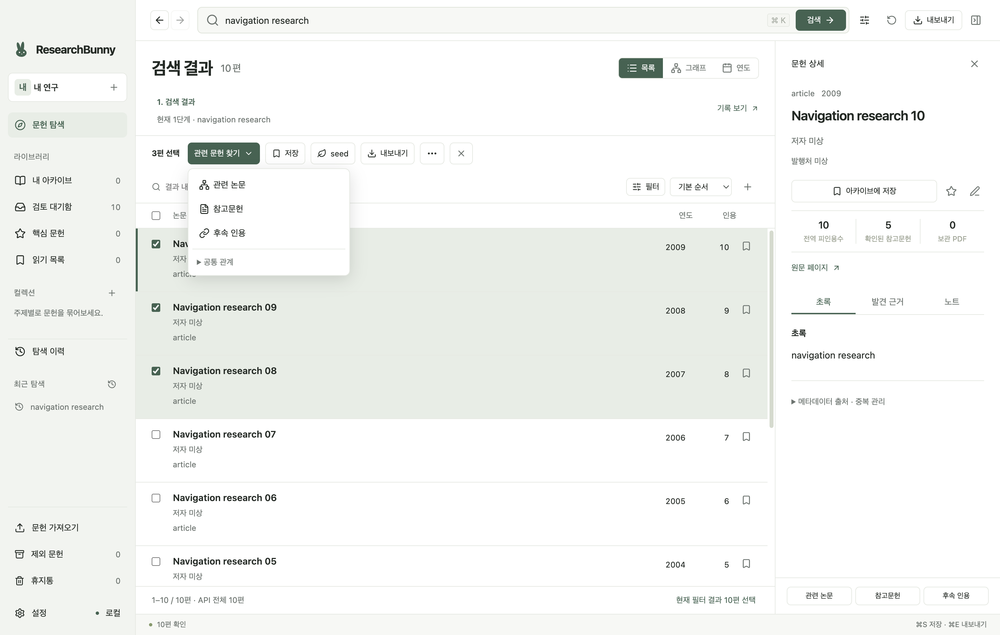
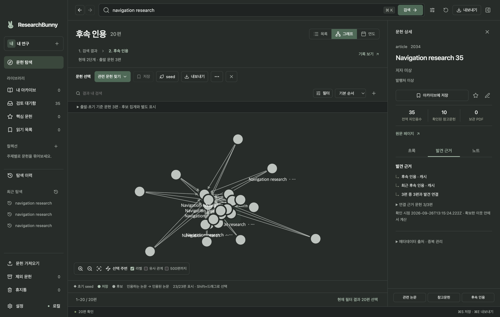
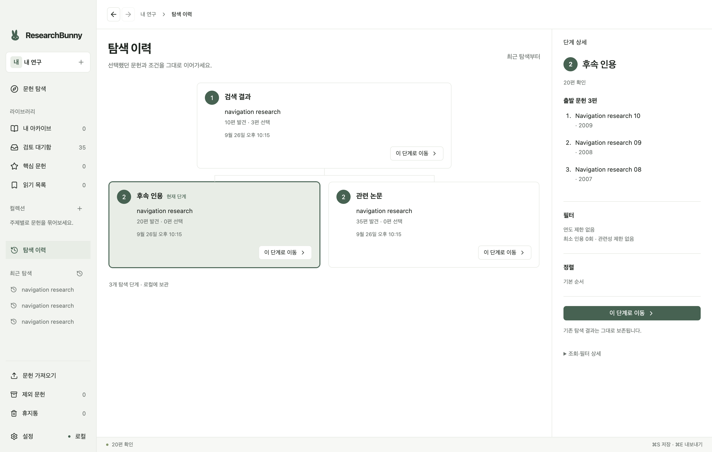
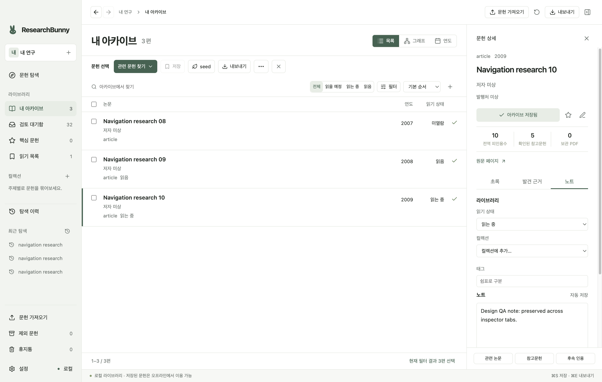
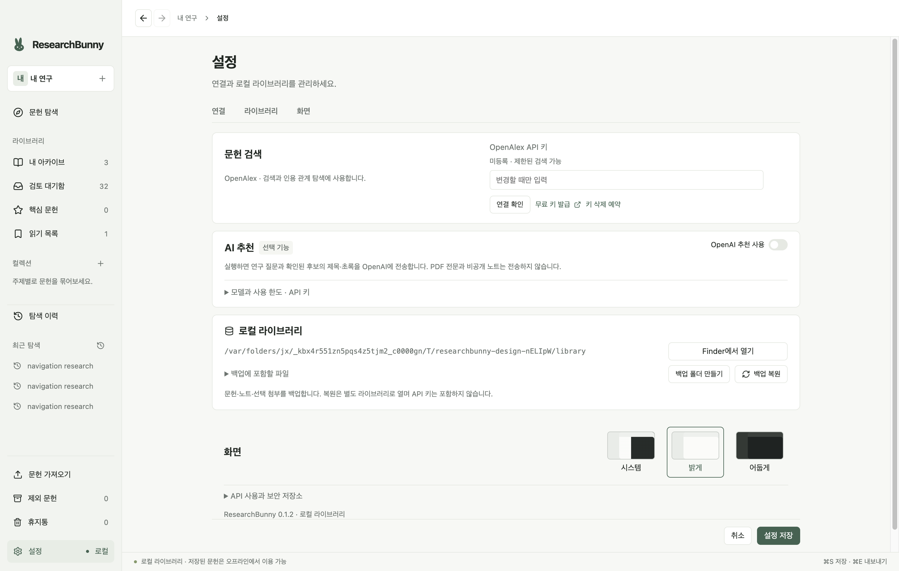

# ResearchBunny 사용 가이드

ResearchBunny는 관심 논문에서 출발해 관련 연구와 인용 관계를 탐색하고, 필요한 문헌을 골라 로컬 아카이브에 보관하는 macOS 앱입니다. 검색 결과를 모두 저장하기보다, **연구 질문에 맞는 논문을 찾고 → 근거를 확인하고 → 선별한 문헌을 정리하는 흐름**으로 사용하면 좋습니다.

이 문서는 **0.1.2**의 화면과 기능을 기준으로 작성했습니다. 아래 그림은 별도의 예제 라이브러리에서 실제 개발 앱을 실행해 촬영한 스크린샷입니다. `Navigation research`라는 논문명, 연도, 인용수와 관계는 동작 설명을 위한 가상 데이터입니다. 기존 0.1.1 설치본에서는 메뉴 배치가 다를 수 있습니다. 설치·실행 방법은 [README](README.md#설치와-실행)를 참고하세요.

## 원하는 작업부터 시작하기

| 지금 하려는 일 | 따라갈 흐름 |
| --- | --- |
| 새로운 주제의 문헌을 찾고 싶다 | [검색하고 초기 관심 정하기](#workflow-1) → [관련 문헌 탐색하기](#workflow-2) |
| 이미 BibTeX나 PDF를 가지고 있다 | [기존 문헌 가져오기](#workflow-3) → seed 지정 → 인용 탐색 |
| 찾은 논문을 읽고 정리하고 싶다 | [아카이브·컬렉션·읽기 관리](#workflow-4) |
| 원고 작성에 사용할 참고문헌을 추리고 싶다 | [BibTeX 내보내기](#workflow-5) |
| API 연결이나 자료 보존을 설정하고 싶다 | [설정·백업·복원](#settings) |

## 1. 화면과 기본 개념 익히기

*그림 1. 왼쪽은 프로젝트와 라이브러리, 가운데는 검색·선별 작업, 오른쪽은 한 논문의 상세 정보입니다.*

| 화면 위치 | 하는 일 |
| --- | --- |
| 왼쪽 위 프로젝트 선택기와 `+` | 연구 주제별 프로젝트를 선택하거나 새로 만듭니다. |
| 왼쪽 `문헌 탐색` | 검색과 관계 탐색 결과를 봅니다. |
| 왼쪽 `내 아카이브`·`검토 대기함` | 저장한 문헌과 아직 선별하지 않은 문헌을 확인합니다. |
| 왼쪽 컬렉션 | 프로젝트 안에서 문헌을 주제·용도별로 묶습니다. |
| 가운데 위 검색창 | 키워드·제목·DOI·OpenAlex ID로 새 문헌을 찾습니다. |
| 결과 위 작업 막대 | 체크한 문헌으로 탐색·저장·seed 지정·내보내기·일괄 편집을 합니다. |
| 오른쪽 문헌 상세 | `초록`, `발견 근거`, `노트` 탭으로 내용을 검토하고 정리합니다. |

**제목을 누르는 것과 체크박스를 선택하는 것은 다릅니다.** 제목을 누르면 오른쪽 상세 패널이 열립니다. 여러 편을 저장하거나 그 논문들에서 탐색을 시작하려면 행 왼쪽 체크박스를 선택하세요. 작업 막대의 `3편 선택`처럼 선택 편수가 표시되는지 확인합니다.

다음 세 가지도 구분해 두세요.

| 개념 | 의미 | 사용하는 순간 |
| --- | --- | --- |
| 선택 문헌 | 지금 일괄 작업에 사용할 논문 집합 | 여러 편 저장·내보내기, 다음 탐색의 출발점 지정 |
| 초기 관심 seed | 연구 질문과 함께 고정해 두는 기준 논문 | 주제 관련성을 판단하고 탐색이 옆길로 새는 것을 줄일 때 |
| 아카이브 | 직접 저장하기로 결정한 문헌 | 읽기·노트·분류·원고 작성에 활용할 자료를 보관할 때 |

단순히 다른 논문을 체크하거나 저장해도 초기 seed는 바뀌지 않습니다. 별표로 표시하는 **핵심 문헌**도 seed와는 별도입니다.

## 2. Workflow 1 — 검색하고 초기 관심 정하기

예를 들어 “양극성장애 유지치료에서 재발 예방 효과를 비교하는 연구”를 모으려 한다고 가정해 보겠습니다. 아래 검색어와 질문은 사용 예시이며, 특정 논문이나 치료에 대한 추천은 아닙니다.

1. 왼쪽 위 프로젝트 옆 `+`로 새 프로젝트를 만듭니다. 이름은 `유지치료 문헌 검토`처럼 작업 목적을 드러내면 다시 찾기 쉽습니다. 기존 `내 연구` 프로젝트에서 바로 시작해도 됩니다.
2. `문헌 탐색`을 열고 검색창에 `bipolar maintenance relapse prevention` 같은 키워드를 입력한 뒤 **검색**을 누릅니다. 이미 아는 논문이라면 제목이나 DOI를 입력합니다.
3. 제목을 눌러 오른쪽 **초록**을 읽고 연도·저자·학술지·원문 페이지를 확인합니다. 검색 옵션에서는 검색 관련순·피인용수순·최신순을 고를 수 있습니다.
4. 연구 질문을 잘 대표하는 논문 몇 편을 체크하고 작업 막대의 **seed**를 누릅니다.
5. **초기 관심 기준 변경** 창에 연구 질문을 작성합니다. 예: “유지치료의 재발 예방 효과를 비교한 임상 연구는 무엇인가?”
6. **선택 N편으로 교체**와 변경 후 편수를 확인한 뒤 **관심 기준 저장**을 누릅니다. 이후에는 `선택 문헌 추가`, `선택 문헌 제거`, `현재 seed 유지`로 기준을 조정할 수 있습니다.
7. 보관할 논문은 별도로 체크한 뒤 **저장**을 누릅니다. 한 편만 저장하려면 행의 저장 아이콘이나 상세 패널의 **아카이브에 저장**을 사용합니다.

**확인할 결과:** 상단에 `초기 관심 N편 고정`과 연구 질문이 나타나고, 저장한 문헌은 왼쪽 **내 아카이브**에서 확인할 수 있습니다. seed 설정은 앞으로의 탐색 기준을 정하는 작업이고, 저장은 문헌을 아카이브에 채택하는 작업입니다.

## 3. Workflow 2 — 관련 문헌을 찾고 탐색을 확장하기

### 목적에 맞는 탐색 선택하기

출발점으로 삼을 논문을 체크하고 **관련 문헌 찾기**를 엽니다. 선택한 논문이 있으면 그 논문들에서, 선택이 없으면 초기 seed에서 탐색합니다. 오른쪽 상세 패널 아래의 탐색 버튼은 현재 열어 본 한 논문에서 시작할 때 사용합니다.

| 메뉴 | 찾는 문헌 | 활용 예 |
| --- | --- | --- |
| 관련 논문 | 출발 논문의 관련 문헌과 인용 이웃 등을 모은 후보 | 같은 문제를 다루는 연구를 넓혀 보기 |
| 참고문헌 | 출발 논문이 인용한 문헌 | 이론·방법·선행 연구의 기반으로 거슬러 올라가기 |
| 후속 인용 | 출발 논문을 인용한 문헌 | 해당 연구를 이어받은 후속 연구 찾기 |
| 공통 관계 → 공통 참고문헌 | 여러 출발 논문이 함께 인용한 문헌 | 여러 연구가 공유하는 기반 찾기 |
| 공통 관계 → 여러 편을 인용한 후속 연구 | 출발 논문 여러 편을 인용한 문헌 | 여러 연구 흐름을 함께 다루는 후속 연구 찾기 |

공통 관계의 **집계 기준**은 `선택 문헌 / 초기 seed` 또는 `프로젝트 아카이브`로 바꿀 수 있습니다. 필터의 **공통 연결**을 높이면 더 많은 출발 문헌과 연결된 후보로 좁혀 볼 수 있습니다. 집계는 앱이 확보한 문헌과 관계 안에서 이루어집니다.

### 결과를 좁히고 선별하기

1. 탐색 결과에서 **필터**를 엽니다.
2. **초기 관심으로 좁히기**를 켜고 주제 관련성을 `균형`으로 시작합니다. 결과가 너무 넓으면 `엄격`, 너무 적으면 `넓게`로 조절합니다.
3. 필요에 따라 출판 기간·문헌 유형·최소 피인용수·포함어·제외어를 설정합니다. 포함어와 제외어는 쉼표로 구분합니다. 최신 연구를 살펴볼 때는 최소 피인용수를 낮게 두는 편이 좋습니다.
4. 제목과 초록을 검토하고 **발견 근거** 탭에서 어떤 경로와 문헌을 통해 발견했는지 확인합니다.
5. 보관할 후보를 체크해 **저장**합니다. 제외할 후보는 **…(일괄 편집)**에서 제외 이유를 적고 **제외**합니다.

관련성은 제목·초록·주제에 기반한 보조 정보입니다. 초록이 부족한 문헌은 판단 보류로 남을 수 있습니다. 결과가 적으면 필터 주변의 숨김·판단 보류 안내를 살펴보고 조건을 완화하거나 **필터 초기화**를 사용하세요.

목록 아래의 **50편 더 표시**는 이미 조회한 자료를 화면에 더 보여 줍니다. **API 추가 조회**는 공급자에게 다음 자료를 더 요청합니다. `API 전체` 편수와 현재 확인한 편수는 다를 수 있으므로, 첫 결과만 보고 검색 전체를 검토했다고 판단하지 마세요.

### 그래프와 연도 보기로 관계 읽기

*그림 2. 그래프에서 논문 사이의 연결을 살펴보고, 오른쪽 발견 근거에서 출발 문헌과의 관계를 확인합니다. 화면은 어두운 테마입니다.*

결과 오른쪽 위에서 **목록 / 그래프 / 연도**를 전환합니다. 목록은 초록 검토와 일괄 선별에, 그래프는 관계 파악에, 연도 보기는 시간 흐름을 살펴보는 데 사용합니다.

- **실선 화살표:** 인용하는 논문 → 인용된 논문. `A → B`라면 A의 참고문헌에 B가 있다는 뜻입니다.
- **점선:** `유사 관계`를 켰을 때 나타나는 관련 관계입니다. 인용 방향으로 해석하지 않습니다.
- **다이아몬드:** 초기 seed. 저장 문헌·후보·선택 상태는 화면 아래 범례와 강조 표시로 구분합니다.
- **조작:** 노드를 눌러 상세 정보를 확인하고, `Shift`를 누른 채 드래그해 여러 노드를 선택합니다. `선택 주변`, `라벨`, 확대·축소·전체 맞춤으로 복잡도를 조절합니다.

그래프는 기본 최대 300편이며 **500편까지**를 켜면 범위를 늘릴 수 있습니다. 인용선도 표시 상한이 있습니다. 화면에 보이지 않는 문헌은 목록과 필터로 확인하세요. 그래프에서 노드가 중앙에 있거나 연결이 많다는 이유만으로 연구의 질이나 중요도가 확정되는 것은 아닙니다.

### 이전 단계로 돌아가 다른 방향 탐색하기

*그림 3. 같은 검색 결과의 세 편에서 관련 논문과 후속 인용으로 각각 출발한 두 갈래입니다. 오른쪽에서 해당 단계의 출발 문헌을 확인합니다.*

1. 검색 결과에서 세 편을 체크해 **관련 논문**을 실행합니다.
2. 상단 **이전 단계(←)**를 눌러 검색 결과로 돌아옵니다. 이전 선택·필터·보기 상태가 복원됩니다.
3. 같은 세 편으로 **후속 인용**을 실행합니다.
4. 왼쪽 **탐색 이력**에서 두 탐색이 원래 검색 단계 아래에 나란히 남았는지 확인합니다.
5. 이어 볼 단계의 **이 단계로 이동**을 누릅니다.

결과 위 **탐색 경로**에서도 부모 단계를 바로 누를 수 있습니다. 다른 방향으로 탐색해도 기존 결과는 이력에 남습니다. 새 키워드 검색은 독립된 경로로 시작합니다.

## 4. Workflow 3 — 기존 BibTeX·PDF에서 시작하기

이미 모아 둔 자료가 있다면 다시 검색하기보다 **문헌 가져오기 → 서지 확인 → seed 지정 → 관계 탐색** 순서로 시작하세요.

### BibTeX 가져오기

1. 왼쪽 아래 **문헌 가져오기**를 누르고 **BibTeX** 탭을 선택합니다.
2. 대상 컬렉션을 선택합니다. 따로 정하지 않으면 **검토 대기함**으로 가져옵니다.
3. **.bib 파일 선택**으로 파일을 열거나, BibTeX 텍스트를 붙여넣고 **가져오기 미리보기**를 누릅니다.
4. 미리보기의 **신규 / 연결 / 오류 / 충돌** 표시를 확인합니다.
5. **확인된 문헌 가져오기**를 누르고 신규·기존 연결·실패 편수를 확인합니다.
6. 가져온 문헌의 제목·저자·연도·DOI를 검토하고 보관할 문헌을 저장합니다. 대표 문헌을 체크해 **seed**로 지정하면 기존 자료에서 탐색을 이어갈 수 있습니다.

### PDF 파일이나 폴더 가져오기

1. **문헌 가져오기 → PDF 파일·폴더**를 엽니다.
2. 대상 컬렉션과 PDF 보관 방식을 선택합니다.
3. 폴더 구조를 분류에 활용하려면 **하위 폴더 이름으로 컬렉션 만들기**를 켭니다.
4. **PDF 선택** 또는 **폴더 선택**으로 가져오기를 시작합니다.
5. 가져오기 기록의 **파일별 결과 보기**에서 실패·미확인 자료를 검토합니다. 실패 파일은 재시도할 수 있습니다.

| 보관 방식 | 동작 | 선택 기준 |
| --- | --- | --- |
| 앱 관리 폴더에 복사 | 원본을 유지하고 앱에 PDF 사본을 보관 | 앱 안에서 파일을 안정적으로 관리하고 싶을 때. 기본값입니다. |
| 기존 위치에 연결 | 기존 파일 위치를 참조 | 이미 운영 중인 PDF 폴더를 계속 사용할 때. 이동·외장 디스크 분리 시 연결 확인이 필요합니다. |
| 서지정보만 가져오기 | 문헌 정보만 가져오고 PDF 첨부는 만들지 않음 | 탐색·인용 목록만 구축할 때 |

PDF를 작업 화면으로 드래그해 가져올 수도 있습니다. 보관 방식을 직접 선택하려면 가져오기 창을 사용하세요. 원본 PDF는 수정·이동·삭제하지 않습니다.

PDF의 메타데이터와 첫 페이지에서 정보를 추출하므로 스캔본·암호화된 파일·정보가 부정확한 파일은 직접 확인해야 합니다. OCR은 지원하지 않습니다. 잘못 추출된 정보는 상세 패널의 연필 아이콘으로 **서지정보 수정**을 열어 바로잡으세요.

가져온 PDF는 **문헌 상세 → 노트 → 첨부 파일**에서 열 수 있습니다. PDF는 macOS의 외부 PDF 앱으로 열립니다. 파일을 옮겨 연결이 끊겼다면 **재연결**로 새 위치를 지정하세요. 문헌을 아카이브에 저장하는 동작 자체가 PDF를 내려받는 것은 아닙니다.

## 5. Workflow 4 — 아카이브를 읽기와 집필에 활용하기

*그림 4. 저장한 세 편을 아카이브에서 보고, 오른쪽 노트 탭에서 읽기 상태·컬렉션·태그·노트를 관리합니다.*

1. **내 아카이브**를 열고 논문 제목을 누릅니다.
2. 오른쪽 **노트** 탭에서 읽기 상태를 `읽을 예정 → 읽는 중 → 읽음`으로 바꿉니다. 아직 읽기 계획이 없으면 `미열람`으로 둡니다.
3. 왼쪽 **컬렉션** 옆 `+`로 `배경 이론`, `주요 임상 연구`, `방법론` 같은 묶음을 만듭니다. 노트 탭의 **컬렉션에 추가…**에서 논문을 넣습니다. 한 논문을 여러 컬렉션에 넣을 수 있습니다.
4. 태그는 `review, maintenance`처럼 쉼표로 나누어 입력합니다.
5. 노트에는 “왜 저장했는지”, “원고의 어느 주장에 활용할지”, “추가로 확인할 한계”를 적습니다. 입력 뒤 **자동 저장** 표시를 확인합니다.
6. 특히 중요한 논문은 상세 패널의 별표를 눌러 **핵심 문헌**에 모읍니다.

아카이브 위 **전체 / 읽을 예정 / 읽는 중 / 읽음** 버튼으로 읽기 상태를 좁혀 볼 수 있습니다. 왼쪽 **읽기 목록**은 `읽을 예정`과 `읽는 중` 문헌을 모으는 작업 목록입니다. 이미 읽은 문헌은 아카이브의 **읽음** 필터에서 확인하세요.

여러 편을 한 번에 정리하려면 체크 후 **…(일괄 편집)**을 엽니다. 컬렉션 저장·읽기 상태 변경·핵심 표시·제외를 수행할 수 있습니다. **태그 적용은 기존 태그에 추가하는 방식이 아니라 입력한 태그로 교체**합니다.

선별에서 제외한 문헌은 **제외 문헌**에서 체크한 뒤 일괄 편집의 **제외 취소**로 검토 대기 상태로 돌릴 수 있습니다. 삭제한 문헌은 **휴지통**에서 체크하고 **휴지통에서 복원**을 사용합니다.

휴지통에서 문헌을 완전히 지우려면 체크한 뒤 상단 **선택 영구 삭제**를 누릅니다. 휴지통 전체를 지우려면 **휴지통 비우기**를 누릅니다. 전체 비우기는 검색·필터나 현재 페이지와 관계없이 현재 프로젝트의 휴지통 전체에 적용됩니다. 확인창에서 편수를 확인하고 **N편 영구 삭제**를 누르면 삭제됩니다. 영구 삭제한 문헌은 복원하거나 실행 취소할 수 없으며, 다른 프로젝트의 문헌과 PDF 파일은 유지됩니다.

## 6. Workflow 5 — 선별한 문헌을 BibTeX로 내보내기

1. 내보낼 문헌을 체크하거나 원하는 컬렉션을 엽니다.
2. 상단 또는 작업 막대의 **내보내기**를 누릅니다.
3. **BibTeX 내보내기** 창에서 범위를 선택하고 표시된 편수를 확인합니다.
4. 필요한 경우에만 노트·태그 또는 PDF 절대 경로 포함을 켭니다. 기본값은 서지정보만 내보냅니다.
5. **파일 저장**을 눌러 `.bib` 파일을 저장합니다. 완료 메시지의 편수와 경로를 확인하고 원고 작성 도구에서 사용합니다.

| 범위 | 포함되는 문헌 |
| --- | --- |
| 선택한 문헌 · 숨겨진 선택 포함 | 체크한 문헌. 필터나 페이지 변경으로 현재 화면에서 보이지 않는 선택도 포함합니다. |
| 현재 필터 결과 · 조회한 문헌 | 앱이 조회한 문헌 중 현재 필터에 맞는 결과. 아직 API로 가져오지 않은 검색 결과는 포함하지 않습니다. |
| 현재 프로젝트 아카이브 | 현재 프로젝트에서 저장한 문헌 |
| 컬렉션 | 창에서 선택한 컬렉션의 문헌 |
| 모든 프로젝트 아카이브 | 전체 프로젝트에서 저장한 문헌 |

검색 후보도 아카이브에 저장하지 않고 선택 내보내기 할 수 있습니다. 전체 결과를 내보내려면 **선택 범위와 편수**를 확인하세요. `⌘A`는 현재 페이지 선택이므로 전체 검색 결과 선택과 다릅니다. 결과 아래 **현재 필터 결과 N편 선택**을 이용할 수도 있습니다.

BibTeX는 다른 도구에서 사용할 참고문헌 파일입니다. 앱의 프로젝트·탐색 이력·첨부 파일까지 보존하려면 다음 절의 **백업**을 사용하세요.

## 7. 설정·선택적 AI·백업

*그림 5. 왼쪽 아래 설정에서 검색 연결, 선택적 AI, 로컬 라이브러리와 화면 테마를 관리합니다. 그림 속 라이브러리 경로는 촬영용 임시 경로입니다.*

### 검색 연결과 화면 설정

**설정 → 문헌 검색**에서 OpenAlex API 키를 입력하고 **연결 확인**을 누릅니다. 확인 후 **설정 저장**을 눌러 적용합니다. 키가 없는 상태의 검색 가능 범위는 공급자 정책과 사용 한도에 따라 달라질 수 있습니다. 연결 오류가 나면 이 화면에서 먼저 상태를 확인하세요.

테마는 **화면 → 시스템 / 밝게 / 어둡게**에서 선택한 뒤 **설정 저장**으로 적용합니다. 문헌·노트·관리 PDF 등 이미 저장된 로컬 자료는 오프라인에서도 사용할 수 있지만 새 검색과 인용 조회에는 네트워크가 필요합니다.

### AI로 출발 후보 찾기 — 선택 기능

AI 추천 없이도 검색·관계 탐색·정리·내보내기를 사용할 수 있습니다. AI 추천을 쓰려면 다음 순서로 준비합니다.

1. 설정에서 **AI 추천 사용**을 켭니다.
2. **AI 연결 방식 → Codex (ChatGPT subscription)**을 선택하고 **ChatGPT로 로그인**합니다. 설치된 공식 Codex CLI와 해당 계정의 Codex 이용 권한을 사용합니다.
3. 연결 상태와 남은 한도를 확인하고 구독 모델을 선택한 뒤 **설정 저장**을 누릅니다. **계정 기본 모델**을 그대로 사용할 수도 있습니다.
4. **문헌 탐색**의 검색창에 연구 질문을 입력합니다.
5. 검색창 옆 **검색 옵션**을 열고 **핵심 논문 찾기**를 실행합니다.
6. 추천된 후보의 초록과 발견 근거를 검토한 뒤, 채택할 문헌을 직접 seed로 지정하거나 저장합니다.

실행하면 연구 질문과 후보의 제목·초록이 OpenAI로 전송됩니다. PDF 전문과 비공개 노트는 전송하지 않습니다. 구독 한도를 확인할 수 없거나 소진되면 중단하며 유료 API로 자동 전환하지 않습니다. 다른 앱과 계정 한도를 공유하고, 앱의 사전 확인은 서버 차원의 추가 과금 차단 설정은 아닙니다. 기존 API 방식은 **OpenAI API · 별도 API 과금**을 직접 선택한 경우에만 사용하며, 그때 API 키·모델·금액 상한을 설정합니다.

구독 로그인은 라이브러리 백업에 포함하지 않습니다. 이 기능은 **실험 기능**이며 실제 추천 품질 평가는 아직 완료되지 않았습니다. 추천을 검토의 출발점으로 사용하세요. 위 설정 화면 이미지는 구독 연결을 추가하기 전 버전입니다.

### 라이브러리 백업과 복원

1. **설정 → 로컬 라이브러리 → 백업에 포함할 파일**을 엽니다.
2. **관리 PDF 포함**을 확인합니다. 기존 위치에 연결한 파일까지 보관하려면 **외부 연결 PDF도 포함**을 켭니다.
3. **백업 폴더 만들기**를 누르고 저장 위치를 선택합니다.
4. 완료 메시지에 첨부 제외·누락이 있는지 확인합니다.
5. 복원할 때는 **백업 복원**에서 백업 폴더를 선택합니다. 앱은 별도 라이브러리에 복원한 뒤 그 라이브러리로 전환하며 기존 라이브러리는 남겨 둡니다.

API 키는 백업에 포함되지 않습니다. 복원 후 누락된 첨부가 보고되면 해당 논문의 **노트 → 첨부 파일 → 재연결**을 사용하세요.

기본 데이터 위치는 `~/Library/Application Support/ResearchBunny/`이며, 실제 라이브러리 경로는 설정에 표시됩니다. **Finder에서 열기**로 위치를 확인할 수 있습니다. 앱 실행 중 데이터베이스 파일 하나만 복사하기보다 앱의 백업 기능을 사용하세요.

## 8. 자주 막히는 지점과 단축키

| 상황 | 확인할 것 |
| --- | --- |
| 논문 상세를 열었는데 여러 편 저장이나 탐색이 안 된다 | 제목 클릭과 체크 선택은 별개입니다. 체크박스와 작업 막대의 선택 편수를 확인하세요. |
| 관련 문헌 찾기의 항목이 비활성이다 | 출발 문헌을 체크하거나 초기 seed를 지정하세요. 공통 관계에서는 프로젝트 아카이브를 집계 기준으로 선택할 수도 있습니다. |
| 결과가 없거나 예상보다 적다 | 연도·관련성·포함어·제외어·저장 문헌 숨김 등을 확인하고 필터를 완화하세요. 남은 결과가 있으면 API 추가 조회를 사용합니다. |
| 이전 선택으로 다른 종류의 탐색을 하고 싶다 | 상단 이전 단계 또는 탐색 경로로 복귀한 뒤 새 탐색을 실행하세요. |
| PDF를 가져왔지만 제목이나 DOI가 틀리다 | 문헌 상세의 서지정보 수정과 가져오기 파일별 결과에서 확인합니다. OCR은 지원하지 않습니다. |
| PDF가 열리지 않는다 | 외장 디스크 연결과 원본 위치를 확인하고 첨부 파일에서 재연결하세요. |
| 내보내기 편수가 예상과 다르다 | 범위 선택, 숨겨진 선택, 현재 조회한 결과 수를 확인하세요. |
| 읽은 논문이 읽기 목록에서 사라졌다 | 읽기 목록은 읽을 예정·읽는 중 문헌입니다. 내 아카이브의 읽음 필터에서 확인하세요. |

| 조작 | 기능 |
| --- | --- |
| `⌘K` | 검색으로 이동 |
| `⌘A` | 입력 중이 아닐 때 현재 페이지 문헌 선택 |
| `⌘S` | 선택 문헌 저장 |
| `⌘E` | 내보내기 창 열기 |
| 목록에서 `Shift`를 누른 채 체크 | 범위 선택 |
| 그래프에서 `Shift` + 드래그 | 여러 노드 선택 |
| 버튼에 마우스를 올리거나 키보드로 초점 이동 | 기능 설명 확인. `Esc`로 설명 닫기 |

처음에는 **논문 몇 편 검색 → 대표 문헌을 seed로 지정 → 참고문헌 또는 후속 인용 한 단계 탐색 → 필요한 문헌 저장 → 노트 작성 → 선택 BibTeX 내보내기**까지 작은 범위로 한 번 진행해 보세요. 이후 같은 프로젝트에서 컬렉션과 탐색 갈래를 늘리면 됩니다.
