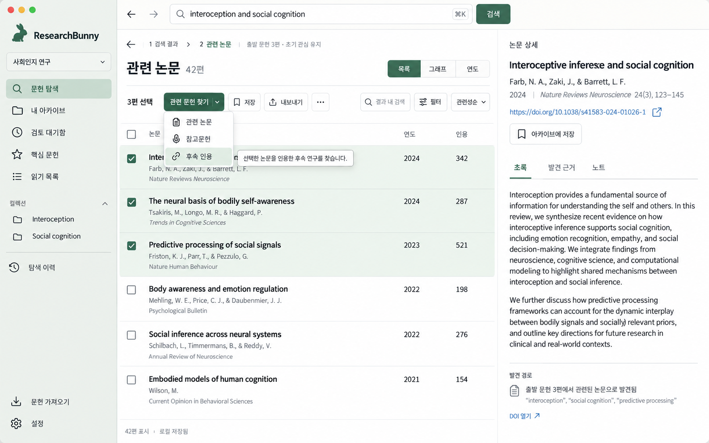
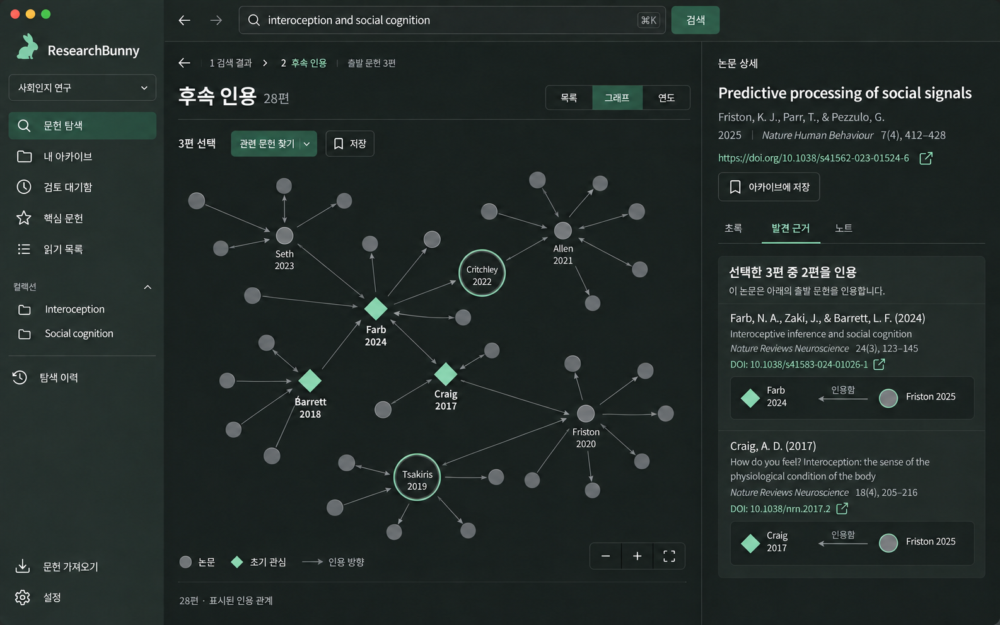
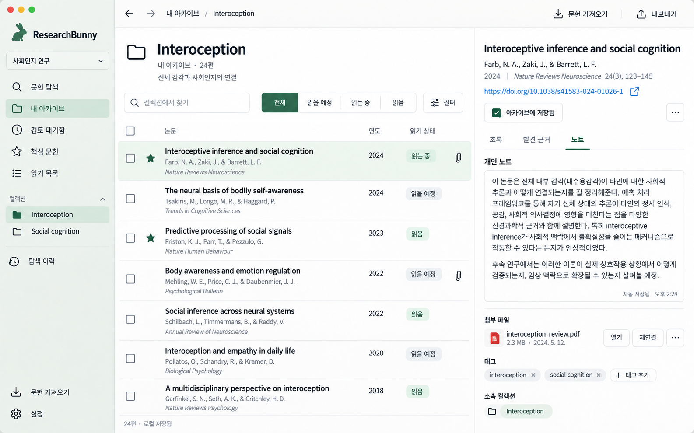
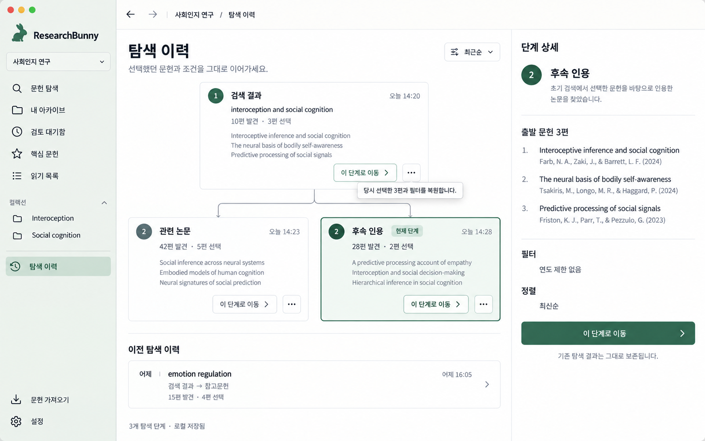
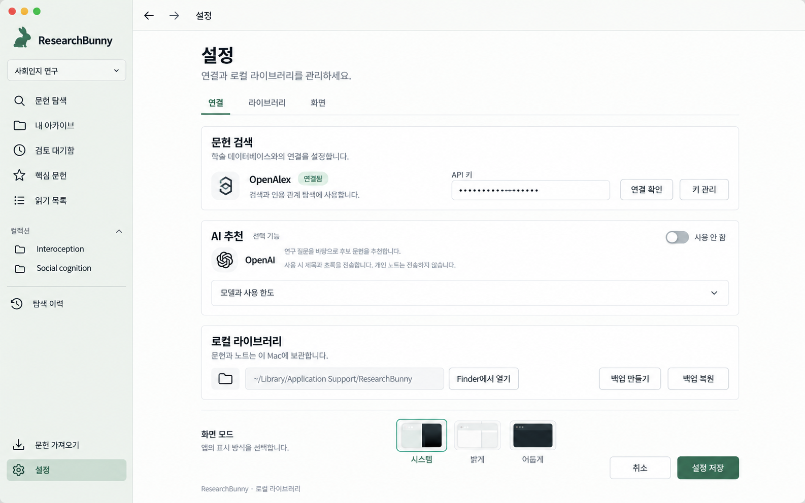

# ResearchBunny — 화면 디자인 시안 v1

2026-09-26 · 내장 imagegen으로 생성한 5개 화면 시안입니다. 앱 코드에 적용하기 전 디자인 검토용이며, 문헌·DOI·인용 관계·수치는 생성된 예시입니다.

[전체 화면 갤러리](gallery.html) · [생성 프롬프트](PROMPTS.md)

방향: 웜 화이트, 차콜, 차분한 그린. 목록의 정보 밀도는 유지하고 제목·메타데이터·버튼의 우선순위를 정리했습니다. 현재 기능을 기반으로 탐색 동작 통합 메뉴, 분기형 이력, 전체 페이지 설정 배치를 제안합니다.

## 1. 검색·선별

선택 문헌의 작업을 한곳에 모으고 탐색 경로를 상단에 고정했습니다.

## 2. 인용 그래프

차콜 다크 모드에서 관계와 선택을 강조하고, 발견 근거를 옆에서 확인합니다.

## 3. 아카이브

목록은 읽기 상태로 정돈하고 오른쪽에서 노트·첨부를 관리합니다.

## 4. 탐색 이력

동일한 선택 문헌에서 갈라진 관련 논문·후속 인용 분기를 한눈에 보여줍니다.

## 5. 설정

검색 연결, 선택적 AI, 로컬 보관을 구분하고 고급 항목은 접어 둡니다.

## 적용 전 확인할 사항

- 이미지의 서체·아이콘·토끼 심볼·문구에는 생성 오차가 있어 구현할 때 일관되게 정리합니다.
- 논문/DOI/초록/인용선은 실제 문헌 근거로 사용하지 않습니다. 구현에서는 실제 앱 데이터와 방향 규칙을 사용합니다.
- 관련 문헌 찾기 메뉴와 펼쳐진 상태의 툴팁은 상호작용 시안입니다.
- 탐색 이력의 검색 단계 아래 관련 논문과 후속 인용은 형제 분기이며, 둘 다 원래 선택한 3편에서 출발합니다.
- 이 작업에서 앱 코드는 수정하지 않았습니다.
